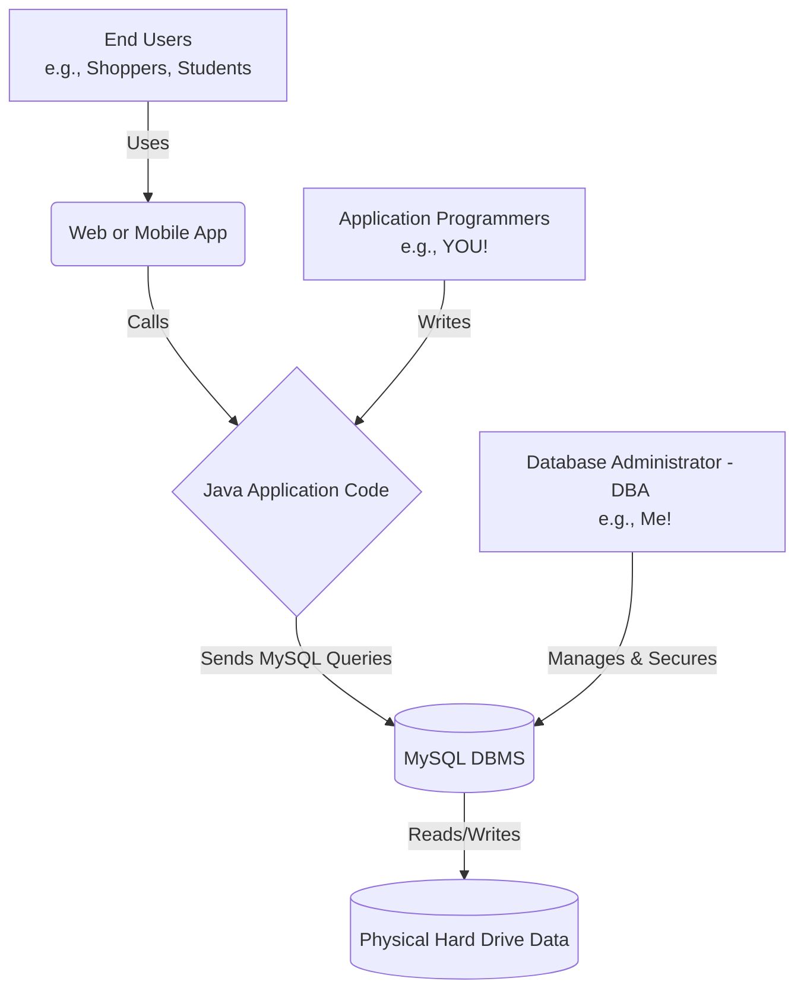

# 📘 Database Management Systems (DBMS): Applications and Users

Hello there! As a Senior Database Administrator with over a decade of experience in top multinational companies, I am excited to help you start your journey. 

While you are learning Java to build applications, the language your database actually speaks is **MySQL** (Structured Query Language). Before building software, we must understand where databases are used (Applications) and who interacts with them (Users). Let's dive in using simple English!

---

## 🌟 1. Database Applications (Where do we use them?)

Almost every software you use daily relies on a Database Management System (DBMS) like MySQL to safely store and organize data. Here are the most common real-world applications:

### A. E-commerce (e.g., Amazon, Flipkart)
* **What it stores:** Product details, prices, user accounts, and shopping carts.
* **Why DBMS is needed:** If two people click "Buy" on the last laptop at the exact same millisecond, the DBMS ensures only one person gets it, preventing inventory errors. (This is called *Concurrency Control*).

### B. Banking and Finance
* **What it stores:** Customer details, account balances, and transaction histories.
* **Why DBMS is needed:** It guarantees money is never lost. If your internet crashes while transferring funds, the DBMS ensures the transaction is safely canceled and rolled back. (These are called *ACID Properties*).

### C. Universities and Education
* **What it stores:** Student records, grades, and course registrations.
* **Why DBMS is needed:** It helps university staff easily search massive amounts of data, like finding "all CS students who scored above 90%."

---

## 👥 2. Database Users (Who interacts with the DBMS?)

Not everyone uses a database the same way. We categorize users based on their technical skills. 

### Visual Diagram: How Users Connect to the Database
Here is a visual map of how different people interact with the data:



Let's look at each user in detail:

### A. Database Administrator (DBA)
* **Who they are:** The "Boss" or Manager of the database (this is my role!).
* **What they do:** We don't write the Java app. We create user accounts, grant security permissions, take backups, and make sure the MySQL database runs super fast and never crashes.

### B. Application Programmers (This is YOU!)
* **Who they are:** Software developers (Java, Python, C++).
* **What they do:** You write the actual application. Your Java code will act as a messenger that sends **MySQL commands** to the database to `INSERT`, `UPDATE`, `DELETE`, or `SELECT` data.

> **💻 Example for a MySQL Learner:**
> Even though you will eventually write Java code, your Java program will send exact MySQL commands to the database behind the scenes. Here is the actual MySQL syntax for creating a bank account and checking a balance:

```sql
-- 1. Create a new database for our bank
CREATE DATABASE bankDB;
USE bankDB;

-- 2. Create a table to hold user accounts (The Blueprint)
CREATE TABLE accounts (
    user_id INT PRIMARY KEY,
    user_name VARCHAR(50),
    balance DECIMAL(10, 2)
);

-- 3. Insert some sample data into the table
INSERT INTO accounts (user_id, user_name, balance) 
VALUES (101, 'Ayush', 5000.50);

-- 4. Ask the database a question (The Query)
-- This is the exact command your future Java app will send!
SELECT balance 
FROM accounts 
WHERE user_id = 101;
```
*Notice how structured the MySQL language is! The database engine processes these commands directly to return your `$5000.50` balance.*

### C. End Users
These are the people who use the software but know nothing about databases or programming.
* **Naïve Users:** They use pre-built apps (like a customer checking a bank balance on their phone). They just push a button, and the app runs the MySQL code for them.
* **Sophisticated Users:** Data analysts who don't write Java code, but they write their own database queries (SQL) to study business trends directly.

### D. System Analysts and Database Designers
* **System Analyst:** Talks to the business owners to figure out exactly what data needs to be saved.
* **Database Designer:** Draws the blueprint of the database, deciding what tables (like `Users`, `Orders`) and data types are needed in MySQL before the programmers start coding.

---

## 🔗 3. Related Topic: The 3-Tier Architecture

Because you are learning how software connects to databases, it is highly recommended you understand how modern apps are structured. They use a **3-Tier Architecture**:

1. **Tier 1: Presentation (Front-End):** The website screen or mobile app the End User sees.
2. **Tier 2: Application (Back-End):** Where your Java code lives. It takes button clicks from Tier 1, processes the rules, and talks to Tier 3.
3. **Tier 3: Data (Database):** The MySQL DBMS. It safely stores the data and executes the SQL commands sent by your Java app.

***