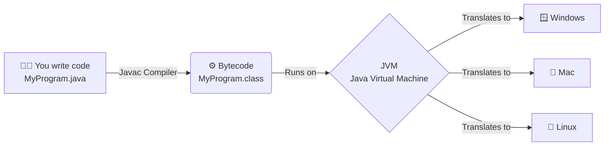

#    🌍Introduction to  Java 
## What is Java?

**Java** is a **high-level, object-oriented, class-based programming language** developed by **James Gosling** and his team at **Sun Microsystems** in **1995** (later acquired by Oracle Corporation).

Java was designed with the principle:

> **"Write Once, Run Anywhere (WORA)"**

This means a Java program is compiled into **bytecode**, which can run on any operating system that has a **Java Virtual Machine (JVM)**.

---

## Technical Definition

Java is a **general-purpose, object-oriented programming language** that converts source code into **bytecode**. The bytecode is executed by the **Java Virtual Machine (JVM)**, making Java platform-independent.

---

# Features of Java

## 1. Platform Independent

Java programs can run on any operating system without changing the source code.

### How?

```
Java Source Code (.java)
        │
        ▼
Compiler (javac)
        │
        ▼
Bytecode (.class)
        │
        ▼
JVM
        │
        ▼
Windows / Linux / macOS
```

### Example

A Java program written on Windows can run on Linux if Linux has a JVM installed.

---

## 2. Object-Oriented (OOP)

Java is based on the concept of **objects and classes**.

It supports the four pillars of OOP:

- Encapsulation
- Inheritance
- Polymorphism
- Abstraction

### Example

```java
class Car {
    String brand = "Toyota";
}
```

Everything in Java revolves around objects.

---

## 3. Simple

Java removes many complex features found in C++, such as:

- Pointer arithmetic
- Multiple inheritance through classes
- Operator overloading
- Manual memory management

Because of this, Java is easier to learn and safer to use.

---

## 4. Secure

Java provides built-in security features.

Some security mechanisms include:

- No direct pointer access
- Bytecode verification
- JVM security checks
- Automatic memory management
- Class Loader

These features reduce the risk of memory corruption and unauthorized access.

---

## 5. Robust

Robust means **strong and reliable**.

Java achieves robustness through:

- Exception Handling
- Automatic Garbage Collection
- Strong Type Checking
- No pointer manipulation

This reduces crashes caused by memory-related errors.

---

## 6. Portable

Java bytecode can be moved from one machine to another without modification.

As long as a JVM is available, the program can execute.

---

## 7. Architecture Neutral

Java bytecode is not tied to any specific processor architecture.

Whether the computer uses Intel, AMD, or ARM processors, the same bytecode can run using the appropriate JVM.

---

## 8. High Performance

Java is faster than many interpreted languages because:

- Source code is compiled into bytecode.
- Modern JVMs use **Just-In-Time (JIT) Compilation**, converting frequently used bytecode into native machine code during execution.

Although Java may not be as fast as C or C++, it provides excellent performance for most applications.

---

## 9. Multithreaded

Java supports **multithreading**, allowing multiple tasks to execute concurrently.

### Example

A web browser can:

- Download files
- Play music
- Load images

at the same time using different threads.

---

## 10. Distributed

Java supports distributed computing through technologies such as:

- Networking APIs
- Sockets
- Remote Method Invocation (RMI)
- Web Services

This makes Java suitable for client-server and enterprise applications.

---

## 11. Dynamic

Java can load classes during runtime.

This allows applications to:

- Extend functionality
- Load external libraries
- Support plugins

without recompiling the program.

---

## 12. Interpreted + Compiled

Java uses both compilation and interpretation.

### Execution Process

```
Source Code (.java)
        │
        ▼
Compiled by javac
        │
        ▼
Bytecode (.class)
        │
        ▼
Executed by JVM
        │
        ▼
Machine Code (using JIT Compiler)
```

# Java Arctiture

# Platform Dependency 

**Platform dependency** refers to a situation where a software application or a compiled program can only run on the specific operating system and hardware architecture it was created for.
* **This happens because each operating system has its' own execution method**
* **Example** Windows use **PE(portable execution)**where as Linux use **ELE(Executabe and Linkable Fromat)**
## What is a "Platform"?
In computing, a platform is the combination of:
1.  **Operating System (OS):** (e.g., Windows, macOS, Linux)
2.  **Hardware Architecture:** (e.g., x86 processors, ARM, Apple Silicon)

## How it Works
When a program is written in a platform-dependent language (like C or C++), the compiler translates the source code directly into **native machine code**. This machine code is a set of binary instructions tailored exclusively for the specific CPU and OS used during compilation.
* **Machine code generated  by different cpu(or processor ) could be different from machine code generated by other.**
*   **Example:** An executable (`.exe`) file compiled for Windows will not run natively on macOS or Linux. To run the program on a different platform, the original source code must be explicitly re-compiled for that new environment.

## Platform Dependent vs. Independent
*   **Platform Dependent (e.g., C, C++):** Source Code $\rightarrow$ Native Machine Code (Runs *only* on the target platform).
*   **Platform Independent (e.g., Java, Python):** Source Code $\rightarrow$ Intermediate Code (Bytecode) $\rightarrow$ Virtual Machin

# Interpretation in Java

While Java is often thought of as a compiled language because of the `javac` compiler, it is fundamentally an **interpreted** language at runtime. This dual nature is what makes Java platform-independent.

Here is a breakdown of how interpretation works in the context of Java.

---

## 1. Where Does Interpretation Happen?
The interpretation process begins *after* the Java source code (`.java`) has been compiled into intermediate Bytecode (`.class`). 

The software responsible for interpretation is the **Java Virtual Machine (JVM)**, specifically a component within it called the **Execution Engine**.

## 2. The Role of the Interpreter
When you run a Java application, the JVM's Interpreter reads the bytecode line by line, translates it into the native machine code understood by the host operating system, and executes it immediately.

### How it works step-by-step:
1.  **Read:** The interpreter fetches the next bytecode instruction.
2.  **Decode:** It determines what native operation corresponds to that instruction.
3.  **Execute:** It commands the CPU to perform the operation.
4.  **Repeat:** It moves to the next line of bytecode.

## 3. Advantages of Interpretation in Java
*   **Platform Independence:** The bytecode is universal. As long as a device has a JVM built for its specific operating system, the JVM's interpreter can translate the universal bytecode into the local machine code. 
*   **Fast Startup:** The interpreter can start executing the program almost immediately because it doesn't need to wait to translate the entire program into native code before running.

## 4. The Problem with Pure Interpretation
While interpreting code line by line starts quickly, it has a major drawback: **poor performance in loops and repetitive tasks**.
* **Slow**
* **Costly**
* source code is reinterpretated every time
* Interpretator is loadaed into memoory.

If your code contains a loop that runs 10,000 times, a pure interpreter will translate those same lines of bytecode into machine code 10,000 times. This overhead makes purely interpreted languages slower than fully compiled languages like C++.

## 5. The Modern Solution: The JIT Compiler
To solve the performance issue of the interpreter, modern JVMs include a **Just-In-Time (JIT) Compiler** alongside the interpreter.

*   The **Interpreter** handles the initial execution and runs code that is only executed once or twice.
*   The **JIT Compiler** monitors the program in real-time. If it notices a specific block of code (like a loop) is being executed repeatedly (a "hotspot"), the JIT compiler steps in, compiles that chunk of bytecode directly into native machine code, and caches it.
*   The next time that code block is reached, the JVM uses the blazing-fast native machine code instead of having the interpreter translate it again.

# Compilation in Java

## What is Compilation?

**Compilation** is the process of converting **Java source code (`.java` file)** into **Bytecode (`.class` file)** that can be understood by the **Java Virtual Machine (JVM)**.

Unlike languages such as C or C++, Java code is **not compiled directly into machine code**. Instead, it is compiled into an intermediate language called **Bytecode**, which makes Java platform-independent.

---

## Simple Definition

> **Compilation in Java is the process of converting human-readable Java source code into platform-independent Bytecode using the Java Compiler (`javac`).**

---

# Why is Compilation Needed?

Computers cannot understand Java code directly.

Humans write:

```java
System.out.println("Hello World");
```

But the CPU only understands **Machine Code (0s and 1s)**.

Therefore, Java first converts source code into **Bytecode**, which the JVM later converts into Machine Code.

---

# Java Compilation Process

```
Java Source Code
      (.java)
          │
          │
          ▼
   Java Compiler (javac)
          │
          ▼
     Bytecode (.class)
          │
          ▼
   Java Virtual Machine (JVM)
          │
          ▼
 Machine Code (CPU Instructions)
          │
          ▼
      Program Output
```

---

# Step-by-Step Compilation Process

## Step 1: Write Java Program

Create a file named:

```
Hello.java
```

Example:

```java
public class Hello {

    public static void main(String[] args) {

        System.out.println("Hello World");

    }

}
```

---

## Step 2: Compile the Program

Open Terminal or Command Prompt and run:

```bash
javac Hello.java
```

Here,

- `javac` = Java Compiler
- `Hello.java` = Source file

---

## Step 3: Bytecode is Generated

After successful compilation:

```
Hello.class
```

is created.

This file contains **Bytecode**.

It is **not Machine Code**.

---

## Step 4: JVM Executes Bytecode

Run:

```bash
java Hello
```

The JVM:

- Loads Bytecode
- Verifies it
- Converts it into Machine Code (using the JIT Compiler)
- Executes it

Output:

```
Hello World
```

---

# Visual Representation

```
          Human
            │
            ▼
   Hello.java (Source Code)
            │
            ▼
      javac Compiler
            │
            ▼
      Hello.class
       (Bytecode)
            │
            ▼
           JVM
            │
            ▼
    Machine Code
            │
            ▼
      Program Runs
```

---

# What is `javac`?

`javac` stands for:

**Java Compiler**

Its job is to:

- Check syntax errors
- Check semantic errors
- Generate Bytecode
- Create `.class` files

Example:

```
javac Hello.java
```

Output:

```
Hello.class
```

---

# What Happens During Compilation?

The Java Compiler performs several checks:

## 1. Lexical Analysis

Breaks source code into **tokens**.

Example:

```java
int age = 20;
```

Tokens:

- int
- age
- =
- 20
- ;

---

## 2. Syntax Checking

Checks whether Java grammar is correct.

Correct:

```java
int age = 20;
```

Incorrect:

```java
int age = ;
```

Compilation Error:

```
Syntax Error
```

---

## 3. Semantic Checking

Checks whether the code makes logical sense.

Example:

```java
int age = "Twenty";
```

Compilation Error:

```
Type Mismatch
```

---

## 4. Bytecode Generation

If no errors exist:

```
Hello.java
```

↓

```
Hello.class
```

is created.

---

# Example

## Source Code

```java
public class Addition {

    public static void main(String[] args) {

        int a = 10;
        int b = 20;

        System.out.println(a + b);

    }

}
```

Compile:

```bash
javac Addition.java
```

Generated:

```
Addition.class
```

Run:

```bash
java Addition
```

Output:

```
30
```

---

# What Happens If Compilation Fails?

Example:

```java
public class Test {

    public static void main(String[] args) {

        System.out.println("Hello")

    }

}
```

Missing semicolon.

Compile:

```bash
javac Test.java
```

Compiler Output:

```
';' expected
```

No `.class` file is created until the error is fixed.

---

# Compilation Errors vs Runtime Errors

| Compilation Error | Runtime Error |
|-------------------|--------------|
| Occurs during compilation | Occurs while the program is running |
| Detected by `javac` | Detected by the JVM |
| `.class` file is not created | `.class` file already exists |
| Example: Missing semicolon | Example: Division by zero |

---

# Is Compilation the Same as Execution?

No.

| Compilation | Execution |
|-------------|-----------|
| Converts source code to Bytecode | Runs the Bytecode |
| Done by `javac` | Done by `java` (JVM) |
| Produces `.class` file | Produces program output |

---

# Commands Used

Compile:

```bash
javac FileName.java
```

Run:

```bash
java FileName
```

---

# Advantages of Java Compilation

- Detects syntax errors before execution.
- Produces platform-independent Bytecode.
- Improves code reliability.
- Enables JVM optimizations.
- Supports Java's "Write Once, Run Anywhere (WORA)" principle.

---
# Understanding Compilation in Java

Java is often described as a "compiled and interpreted" language. Unlike languages such as C or C++, which compile directly to machine code specific to an operating system, Java uses a unique two-step process that allows it to achieve its famous **"Write Once, Run Anywhere" (WORA)** capability.

Here is a detailed breakdown of how compilation works in the context of Java.

---

## 1. The Source Code (`.java`)
The journey begins with the programmer writing human-readable Java code and saving it in a text file with a `.java` extension. 
*Example: `HelloWorld.java`*

## 2. The Java Compiler (`javac`)
When you compile a Java program, you use the Java Compiler command (`javac`). 

Unlike traditional compilers that translate source code directly into native machine code (binary code understood by the CPU), `javac` translates the Java source code into an intermediate representation called **Bytecode**.

*   **Command:** `javac HelloWorld.java`
*   **Output:** `HelloWorld.class` (This file contains the bytecode).

During this stage, the compiler also performs:
*   **Syntax Checking:** Ensures the code strictly follows Java's grammatical rules.
*   **Static Type Checking:** Verifies that variables and methods are used correctly according to their declared types.

## 3. What is Bytecode?
Bytecode is a highly optimized set of instructions designed to be executed by the **Java Virtual Machine (JVM)**, not directly by your computer's hardware. 

Bytecode is **platform-independent**. A `.class` file generated on a Windows machine is identical to one generated on a macOS or Linux machine. The underlying hardware doesn't matter at this stage.

## 4. The Java Virtual Machine (JVM)
To run the compiled bytecode, you need the JVM. The JVM acts as a virtual computer inside your actual operating system. The process of executing the bytecode involves several internal JVM components:

### A. Class Loader
When you run the program (using the `java HelloWorld` command), the JVM uses the Class Loader subsystem to load the `.class` files into RAM. It also dynamically loads any other necessary standard Java libraries (like `java.lang.String`).

### B. Bytecode Verifier
Before execution, the JVM verifies the bytecode to ensure it is valid, doesn't violate any security constraints, and doesn't contain illegal instructions that could crash the host machine.

### C. Execution Engine
This is where the bytecode is finally translated into the native machine code of the host operating system. The Execution Engine handles this using two main methods working together:

1.  **Interpreter:** It reads the bytecode line by line, translating and executing it on the fly. While this starts up quickly, interpreting code repeatedly line-by-line is slow.
2.  **JIT (Just-In-Time) Compiler:** To solve the interpreter's performance issue, the JVM uses the JIT compiler. The JIT compiler monitors the bytecode as it runs. If it finds blocks of code (like loops or frequently called methods) that are executed often (called "hotspots"), it compiles that specific bytecode directly into native machine code in real-time. The next time that code block is called, the JVM runs the fast native machine code instead of re-interpreting the bytecode.

---

## Summary Workflow

```text
[Human Readable]                  [Platform Independent]                 [Platform Specific]
       |                                    |                                     |
 1. Programmer                      3. Bytecode                         5. Execution Engine
 Writes `Program.java`              Produces `Program.class`            (JIT Compiler / Interpreter)
       |                                    |                                     |
       v                                    v                                     v
 2. Compiler (`javac`)  =======>    4. JVM (Runtime)          =======>  6. Hardware CPU
 Checks syntax & compiles           Loads & verifies .class             Executes native machine code
```


# Platform Independency in Java

 **platform independency** is the cornerstone of its design, famously encapsulated by the slogan **"Write Once, Run Anywhere" (WORA)** [cite: 1, 4]. 
 It means that a Java program written and compiled on one operating system (like Windows) can be executed on any other operating system (like macOS or Linux) without needing modifications or recompilation [cite: 4].


---

## 1. The Two-Step Execution Process
Unlike languages such as C or C++, which are platform-dependent because they compile directly into native machine code specific to the host OS and CPU [cite: 1, 4], Java uses a two-step process to separate the code from the underlying hardware.

### Step 1: Compilation to Bytecode
When you write Java source code (`.java` files) [cite: 1] and compile it using the Java compiler (`javac`) [cite: 1], the compiler does not produce native machine code. Instead, it generates an intermediate, highly optimized set of instructions called **Bytecode** (`.class` files) [cite: 1, 4]. 

*   **Bytecode is universal:** A `.class` file generated on a Windows machine is identical down to the byte to one generated on a Linux machine [cite: 1]. The hardware does not matter at this stage [cite: 1].

### Step 2: Execution by the JVM
To run this universal bytecode, Java relies on the **Java Virtual Machine (JVM)** [cite: 1, 4]. The JVM is a software-based engine that acts as a virtual computer running inside your actual operating system [cite: 1]. 

*   When you execute a Java program, the JVM loads the `.class` files [cite: 1].
*   The JVM's internal **Execution Engine** (using an Interpreter and a Just-In-Time (JIT) Compiler) translates the universal bytecode into the specific native machine code understood by the local hardware on the fly [cite: 1, 3, 4].

## 2. The Irony: The JVM is Platform-Dependent
To achieve platform independence for your Java *code*, the runtime environment itself must be tailored to the host system. 

*   **The Code is Independent:** You only write and compile your `.java` file once [cite: 4].
*   **The JVM is Dependent:** You must download and install a specific version of the JVM designed for Windows, a different one for macOS, and a different one for Linux [cite: 4]. 

Because Oracle and the open-source community have built JVMs for virtually every operating system and hardware architecture, your standardized bytecode can run almost anywhere.

## 3. Workflow Summary

| Stage | Output | Dependency | Description |
| :--- | :--- | :--- | :--- |
| **Source** | `.java` file | Independent | Human-readable Java code written by the programmer [cite: 1]. |
| **Compiler** | `.class` file | Independent | `javac` translates source code into universal Bytecode [cite: 1]. |
| **JVM** | Machine Code | **Dependent** | Translates Bytecode into native instructions for the specific OS/CPU [cite: 1, 3]. |
----

# The Java Ecosystem: Understanding JDK, JRE, and JVM

To truly master Java, it is essential to understand its core architecture. The Java ecosystem is built on three interconnected components: the **JDK**, the **JRE**, and the **JVM**. 

They operate in a nested hierarchy, where each outer layer includes the inner layers while adding its own specific capabilities.

---

## The Visual Hierarchy

The relationship between these three components can be visualized as a set of nested boxes. The JDK is the largest, containing the JRE, which in turn contains the JVM.

```text
+--------------------------------------------------------------------+
|                      JDK (Java Development Kit)                    |
|                                                                    |
|  +--------------------------------------------------------------+  |
|  |                   JRE (Java Runtime Environment)             |  |
|  |                                                              |  |
|  |  +--------------------------------------------------------+  |  |
|  |  |                JVM (Java Virtual Machine)              |  |  |
|  |  |                                                        |  |  |
|  |  |  * Class Loader                                        |  |  |
|  |  |  * Bytecode Verifier                                   |  |  |
|  |  |  * Execution Engine (Interpreter + JIT Compiler)       |  |  |
|  |  +--------------------------------------------------------+  |  |
|  |                                                              |  |
|  |  +--------------------------------------------------------+  |  |
|  |  |   Core Java Libraries (java.lang, java.util, etc.)     |  |  |
|  |  |   Other standard runtime files                         |  |  |
|  |  +--------------------------------------------------------+  |  |
|  +--------------------------------------------------------------+  |
|                                                                    |
|  +--------------------------------------------------------------+  |
|  |   Development Tools (javac, jdb, javadoc, jar, etc.)         |  |
|  +--------------------------------------------------------------+  |
+--------------------------------------------------------------------+
```

---

## 1. JVM: Java Virtual Machine (The Engine)
The **JVM** is the innermost layer and the heart of the Java execution process. It is a software-based virtual computer that runs inside your actual operating system [cite: 6]. 

**What it does:**
*   It takes the compiled Java **bytecode** (`.class` files) and translates it into the native machine code of your specific hardware [cite: 6].
*   It uses a combination of an **Interpreter** (for quick startup) and a **Just-In-Time (JIT) Compiler** (for high performance by compiling frequently used code blocks directly to native code) [cite: 6].
*   **Platform Dependency:** While Java code is platform-independent, the JVM itself is platform-dependent (you need a specific JVM for Windows, Linux, or macOS) [cite: 6].

**Analogy:** The JVM is like a car engine. It is the mechanism that actually does the work of moving the vehicle forward, but an engine alone isn't enough to drive.

---

## 2. JRE: Java Runtime Environment (The Environment)
The **JRE** is the middle layer. It is the minimum environment required to *run* a Java application. If a user simply wants to play a Java-based game or run a Java desktop application, they only need to install the JRE.

**What it contains:**
*   **The JVM:** It houses the execution engine [cite: 6].
*   **Core Libraries:** It includes the standard class libraries (like `java.util` for data structures, `java.io` for input/output) and other supporting files that the JVM needs to execute programs properly.

**Analogy:** The JRE is the complete car. It has the engine (JVM), but also the wheels, steering wheel, and chassis (Core Libraries) needed to actually drive it on the road.

---

## 3. JDK: Java Development Kit (The Toolkit)
The **JDK** is the outermost layer. It is the complete software development environment used by programmers to *develop*, compile, and run Java applications.

**What it contains:**
*   **The JRE:** It includes the entire runtime environment (JVM + Libraries) so developers can test and run their own code.
*   **Development Tools:** It adds the necessary tools to write software, such as:
    *   `javac`: The Java Compiler (turns `.java` source code into `.class` bytecode) [cite: 5].
    *   `jdb`: The Java Debugger.
    *   `javadoc`: A tool to generate API documentation.

**Analogy:** The JDK is the entire car factory. It contains the complete car ready to drive (JRE), the engine (JVM), but also all the tools, robots, and machinery (Development Tools) required to build and test *new* cars.

---

## Summary Comparison

| Component | Stands For | Primary Purpose | Target Audience | Contains |
| :--- | :--- | :--- | :--- | :--- |
| **JVM** | Java Virtual Machine | Executes bytecode [cite: 6] | Internal execution engine | Class Loader, Verifier, Execution Engine [cite: 6] |
| **JRE** | Java Runtime Environment | Runs Java applications | End-Users | JVM + Core Libraries |
| **JDK** | Java Development Kit | Develops Java applications | Programmers / Developers | JRE + Development Tools |


# My First java Program
 * **HelloWOrld Program**
 ```
 import java.lang*; // it is used for importing java and it's various library.
 public class myFirst{
    public static void main(String[] args){    // it is written in this way beacause java compiler accepts the **main method** in this way only
        System.out.println("Hello World !");
    }
 }
 ```

 # 1. What is the Scanner Class?

The `Scanner` class is a built-in feature in Java used to read input from various sources like the keyboard, files, or even strings. For beginners, we mostly use it to read input from the **keyboard**.

It is located in the `java.util` package. A package is simply a folder where related Java features are stored. Because it's in a separate folder, we have to **import** it before we can use it.

### Syntax to Import:
```java
import java.util.Scanner;
```

---

## 2. How to Create a Scanner Object

Before you can use the `Scanner`, you must create an "object" (an instance) of it. 

### Syntax:
```java
Scanner myScanner = new Scanner(System.in);
```

**Let's break this down:**
*   `Scanner`: The type of object we are making.
*   `myScanner`: The name we are giving to our scanner (you can name it `input`, `sc`, or anything you like!).
*   `new Scanner(...)`: This creates the actual object in the computer's memory.
*   `System.in`: This tells the Scanner *where* to listen for input. `System.in` means "Standard Input," which is your keyboard!

---

## 3. Important Methods of the Scanner Class

A **method** is simply an action that an object can perform. Depending on what kind of data you want from the user (a number, a word, a sentence), you use a different method.

Here is a visual cheat sheet of the most important methods:

| Method | What it reads | Example Input | Java Data Type |
| :--- | :--- | :--- | :--- |
| **`nextLine()`** | Reads a **complete line** of text (until you press Enter). | "John Doe" | `String` |
| **`next()`** | Reads a **single word** (stops at the first space). | "John" | `String` |
| **`nextInt()`** | Reads an **integer** (whole number). | `25` | `int` |
| **`nextDouble()`** | Reads a **decimal number**. | `19.99` | `double` |
| **`nextBoolean()`**| Reads a **true or false** value. | `true` | `boolean` |
| **`close()`** | Closes the scanner to save computer memory. | N/A | N/A |

---

## 4. Complete Code Example

Let's put it all together in a real Java program. You can copy and paste this into your IDE (like IntelliJ, Eclipse, or VS Code) to run it!

```java
import java.util.Scanner; // Step 1: Import the Scanner class

public class Main {
    public static void main(String[] args) {
        
        // Step 2: Create a Scanner object to read from the keyboard
        Scanner sc = new Scanner(System.in);

        // --- Example 1: Reading a String (Whole line) ---
        System.out.print("Enter your full name: ");
        String name = sc.nextLine(); 

        // --- Example 2: Reading an Integer ---
        System.out.print("Enter your age: ");
        int age = sc.nextInt();

        // --- Example 3: Reading a Double (Decimal) ---
        System.out.print("Enter your exact height in meters (e.g., 1.75): ");
        double height = sc.nextDouble();

        // --- Example 4: Reading a Boolean ---
        System.out.print("Do you love programming? (true/false): ");
        boolean lovesCoding = sc.nextBoolean();

        // Step 3: Print out the collected information
        System.out.println("\n--- User Profile ---");
        System.out.println("Name: " + name);
        System.out.println("Age: " + age);
        System.out.println("Height: " + height + "m");
        System.out.println("Loves Coding: " + lovesCoding);

        // Step 4: Close the scanner! (Good practice)
        sc.close();
    }
}
```

---

## 5. Related Topic: The "NextLine Gotcha" (Very Important!)

As a senior developer, I see beginners struggle with this specific bug all the time. 

**The Problem:**
If you ask for a number using `nextInt()` or `nextDouble()`, and *then* try to ask for a String using `nextLine()`, the program will seemingly skip the `nextLine()` and not let you type anything!

**Why does this happen?**
When you type a number (e.g., `25`) and press **Enter**, the `nextInt()` method grabs the `25`, but it leaves the **Enter key** (called a newline character) floating in the computer's memory. When `nextLine()` comes along, it sees that leftover Enter key, thinks you instantly pressed Enter, and moves on without letting you type!

**The Solution:**
Add an extra `sc.nextLine();` right after your `nextInt()` to "eat" the leftover Enter key.

### Example of the Fix:
```java
System.out.print("Enter your age: ");
int age = sc.nextInt();

sc.nextLine(); // <--- THE FIX: This consumes the leftover Enter key!

System.out.print("Enter your favorite color: ");
String color = sc.nextLine(); // Now this will work perfectly!
```
 