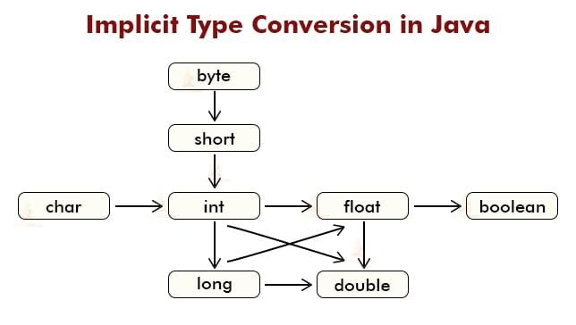
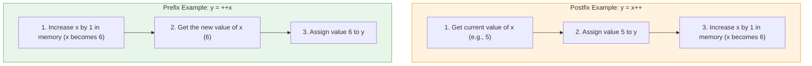
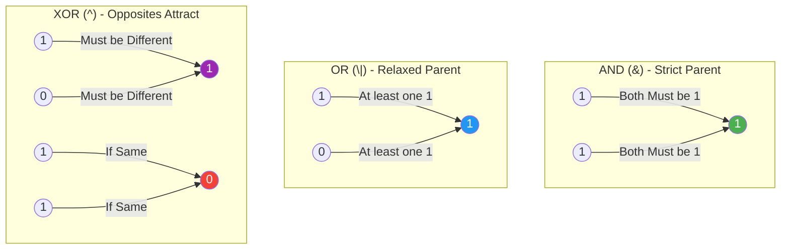

# Operator
## 1️⃣ What is an Operator?

Think of an operator as a special symbol that tells the computer to perform a specific mathematical or logical task. 
For example, in simple math: `5 + 3`, the `+` is the operator. The numbers `5` and `3` are called **operands**.

---

## 2️⃣ Arithmetic Operators in Java

Java uses these basic operators to perform everyday math. 

| Operator | Name | What it does | Example | Result |
| :---: | :--- | :--- | :--- | :--- |
| `+` | **Addition** | Adds two values together | `5 + 3` | `8` |
| `-` | **Subtraction** | Subtracts one value from another | `10 - 4` | `6` |
| `*` | **Multiplication**| Multiplies two values | `4 * 3` | `12` |
| `/` | **Division** | Divides one value by another | `10 / 2` | `5` |
| `%` | **Modulo** | Gives the **remainder** of a division | `10 % 3` | `1` (Because 10/3 is 3 with remainder 1) |

### 💻 Code Example: Arithmetic Operators
```java
public class ArithmeticDemo {
    public static void main(String[] args) {
        int a = 10;
        int b = 3;

        System.out.println("Addition: " + (a + b));       // Output: 13
        System.out.println("Subtraction: " + (a - b));    // Output: 7
        System.out.println("Multiplication: " + (a * b)); // Output: 30
        System.out.println("Division: " + (a / b));       // Output: 3 (Note: decimal is dropped for integers!)
        System.out.println("Modulo: " + (a % b));         // Output: 1
    }
}
```

---

## 3️⃣ What is an Expression?

An **expression** is simply a combination of variables, numbers (literals), and operators that produces a single final value.

*   `x + 5` is an expression.
*   `(a * b) / c` is an expression.

---

## 4️⃣ Precedence Order (BODMAS for Java)

When you have a long expression like `5 + 10 * 2`, which part does Java calculate first? Does it do `5 + 10` first, or `10 * 2` first? 

Java follows strict rules called **Operator Precedence** (just like BODMAS or PEMDAS in math).

### 🥇 The Priority List (Highest to Lowest)
1.  **Parentheses `( )`**: Highest priority! Always do what's inside brackets first.
2.  **Multiplication, Division, Modulo `*`, `/`, `%`**: These share the same priority.
3.  **Addition, Subtraction `+`, `-`**: Lowest priority.

*Note: If operators have the **same priority** (like `*` and `/`), Java reads them from **Left to Right** (this is called Associativity).*

### 🧠 Let's evaluate an expression together:
**Expression:** `int result = 5 + 10 * 2;`
1. Multiplication `*` has higher priority than Addition `+`.
2. First: `10 * 2` becomes `20`.
3. Second: `5 + 20` becomes `25`.
**Final Result:** `25`

**Expression with Parentheses:** `int result2 = (5 + 10) * 2;`
1. Brackets `()` have the highest priority.
2. First: `5 + 10` becomes `15`.
3. Second: `15 * 2` becomes `30`.
**Final Result:** `30`

---

## 5️⃣ Expressions of Different Data Types & Coercion

What happens when you mix different types of data? For example, adding an `int` (whole number) and a `double` (decimal number)?

Java uses something called **Coercion** (also known as **Type Promotion** or **Implicit Type Casting**). 

**The Golden Rule:** Java always wants to prevent data loss. So, it automatically upgrades (promotes) the smaller data type into the larger data type before doing the math!

### 🚦 The Promotion Visual:
Imagine a small box fitting into a bigger box.
`byte` ➡️ `short` ➡️ `int` ➡️ `long` ➡️ `float` ➡️ `double`

*   If you multiply an `int` by a `double`, Java temporarily turns the `int` into a `double`, and the final answer is a `double`.
*   **Special Rule for whole numbers:** In Java, if you do math with `byte`, `short`, or `char`, Java *automatically* promotes them to `int` before calculating.

### 💻 Code Example: Coercion in Action
```java
public class CoercionDemo {
    public static void main(String[] args) {
        int myInt = 5;
        double myDouble = 2.5;
        
        // myInt is automatically promoted to double (5.0) before addition
        double result = myInt + myDouble; 
        
        System.out.println("Result is: " + result); // Output: 7.5
        
        // Important Note on Division!
        int x = 5;
        int y = 2;
        System.out.println("Integer math: " + (x / y)); 
        // Output is 2! (Because int/int = int. The decimal .5 is thrown away)
        
        // How to fix integer division using Coercion? Make one a double!
        System.out.println("Double math: " + ((double)x / y)); 
        // Output is 2.5! (Here, we force x to be 5.0. Then 5.0 / 2 = 2.5)
    }
}
```

### 🔁 Explicit Casting (Manual Coercion)
Sometimes, you want to go backward (from a big box to a small box). Java won't do this automatically because you might lose data (like losing decimal points). You have to do it manually by putting the target type in parentheses. This is called **Explicit Casting**.
* **Explicit casting is also known as Downcasting.**
```java
double price = 9.99;
int roundedPrice = (int) price; // We are forcing a double into an int

System.out.println(roundedPrice); // Output: 9 (The .99 is completely chopped off!)
```
## 🌟 What is Implicit Casting?
**Implicit Casting** (also known as **Widening Casting**) happens **automatically** when you convert a smaller data type into a larger data type.
* 📊 **Implicit Casting is also known as upcasting.** 
## 📊 The Rule of Implicit Casting (Visual Map)

Implicit casting only works when you go from left to right in this flow:

```text
  [SMALLEST]                                                       [LARGEST]
    byte  ➔  short  ➔  char  ➔  int  ➔  long  ➔  float  ➔  double
```
*Note: You can safely move a value from any type on the left to any type on the right.*


---
## 💻 Syntax and Code Example

Here is a simple Java program to show you how implicit casting works in action.

```java
public class ImplicitCastingExample {
    public static void main(String[] args) {
        
        // Step 1: We create a small container (int) and put the number 100 in it.
        int myInt = 100;
        
        // Step 2: We pour the 'int' into a larger container (double).
        // Java does this AUTOMATICALLY! You don't need any special syntax.
        double myDouble = myInt; 
        
        // Step 3: Let's print them out to see what happened.
        System.out.println("Original int value: " + myInt);      // Output: 100
        System.out.println("Converted double value: " + myDouble); // Output: 100.0
        
        /* 
           Notice that Java automatically added ".0" at the end because 
           'double' is used to store decimal numbers. We didn't lose any data!
        */
    }
}
```

---
---


---

# 🚀 Java Increment and Decrement Operators

*   **Increment Operator (`++`)**: Adds `1` to a variable.
*   **Decrement Operator (`--`)**: Subtracts `1` from a variable.

Instead of writing `x = x + 1;`, you can simply write `x++;`. It saves time and makes your code look cleaner!

## 2. The Two Types: Prefix and Postfix

Here is where it gets interesting. You can put these operators *before* the variable or *after* the variable. Both will change the value by 1, but they do it at slightly different times.

### A. Postfix (After the variable)
*   **Syntax:** `variable++` or `variable--`
*   **Rule:** **"Use first, change later."** Java will use the *current* value of the variable in the statement, and *then* increase/decrease it.

### B. Prefix (Before the variable)
*   **Syntax:** `++variable` or `--variable`
*   **Rule:** **"Change first, use later."** Java will increase/decrease the variable *first*, and then use the *new* value in the statement.

---

## 3. Visualizing the Difference 👀

Let's imagine you have a box (variable `x`) with the number `5` inside.

### Example 1: Postfix (`x++`)
```java
int x = 5;
int y = x++; // Postfix
```
**What happens step-by-step:**
1. Java looks at `x` (it is 5).
2. Java gives the value `5` to `y`. **(y is now 5)**
3. Java increases `x` by 1. **(x is now 6)**

### Example 2: Prefix (`++x`)
```java
int x = 5;
int y = ++x; // Prefix
```
**What happens step-by-step:**
1. Java increases `x` by 1 right away. **(x is now 6)**
2. Java gives the *new* value `6` to `y`. **(y is now 6)**

---

## 4. Complete Code Example 💻

Copy and paste this into your Java editor to see it in action!

```java
public class OperatorsDemo {
    public static void main(String[] args) {
        
        System.out.println("--- Postfix Increment ---");
        int a = 10;
        System.out.println("Original a: " + a);       // Outputs 10
        System.out.println("Using a++ : " + (a++));   // Outputs 10 (Uses first, then adds 1)
        System.out.println("After a++ : " + a);       // Outputs 11

        System.out.println("\n--- Prefix Increment ---");
        int b = 10;
        System.out.println("Original b: " + b);       // Outputs 10
        System.out.println("Using ++b : " + (++b));   // Outputs 11 (Adds 1 first, then uses)
        System.out.println("After ++b : " + b);       // Outputs 11
        
        System.out.println("\n--- Decrement Example ---");
        int c = 5;
        System.out.println("Using c-- : " + (c--));   // Outputs 5 (then c becomes 4)
        System.out.println("Using --c : " + (--c));   // Outputs 3 (c was 4, decreases to 3, then uses)
    }
}
```

---
# Bitwise Operators

## 1. What is a "Bit"? (The Very Basics) 🧱
Before we talk about bitwise operators, we need to know what a **bit** is. 
Computers don't understand English, numbers, or pictures. They only understand **Electricity ON** and **Electricity OFF**.
* We write ON as `1`
* We write OFF as `0`

These `0`s and `1`s are called **Bits** (Binary Digits). 
When you write the number `5` in Java, the computer stores it as a binary number: `0101`.

## 2. What are Bitwise Operators? 🛠️
Normally, you add or multiply normal numbers (like `5 + 3`). But sometimes, you want to jump under the hood and play with the actual `0`s and `1`s directly. **Bitwise operators** allow you to compare and move these individual bits.

Here are the 7 bitwise operators in Java:

| Operator | Name | What it does |
| :---: | :--- | :--- |
| `&` | **Bitwise AND** | Results in 1 *only if both* bits are 1. |
| `\|` | **Bitwise OR** | Results in 1 *if at least one* bit is 1. |
| `^` | **Bitwise XOR** | Results in 1 *if the bits are different*. |
| `~` | **Bitwise NOT** | Flips all the bits (0 becomes 1, 1 becomes 0). |
| `<<` | **Left Shift** | Shifts bits to the left. |
| `>>` | **Signed Right Shift**| Shifts bits to the right (keeps sign). |
| `>>>`| **Unsigned Right Shift**| Shifts bits to the right (fills with zeros).|

---
### Visualing Bitwise operators

### Combined Truth Table for `&`, `|`, and `^`

Let's imagine we have two bits, **A** and **B**.

| Bit A | Bit B | A & B (AND) | A \| B (OR) | A ^ B (XOR) |
| :---: | :---: | :---------: | :---------: | :---------: |
|   0   |   0   |      0      |      0      |      0      |
|   0   |   1   |      0      |      1      |      1      |
|   1   |   0   |      0      |      1      |      1      |
|   1   |   1   |      1      |      1      |      0      |

### Truth Table for `~` (NOT)
This operator works on only **one** bit at a time. It simply flips the bit!

| Bit A | ~A (NOT A) |
| :---: | :--------: |
|   0   |     1      |
|   1   |     0      |

### For any integer A:  ~A = -(A + 1) 


---

## 3. Detailed Explanations & Examples 💻

Let's look at two numbers for our examples:
* `A = 5` (Binary: `0101`)
* `B = 3` (Binary: `0011`)

### A. Bitwise AND (`&`)
**Rule:** Both must be 1 to get a 1. Otherwise, it's 0.
*Think of it like a strict parent: BOTH mom AND dad must say "yes" for you to go to the party.*

**Visual Operation:**
```text
  0101  (Number 5)
& 0011  (Number 3)
  ----
  0001  (Result is 1)
```

**Java Code:**
```java
public class BitwiseExample {
    public static void main(String[] args) {
        int a = 5; 
        int b = 3; 
        int result = a & b; 
        System.out.println("5 & 3 = " + result); // Output: 1
    }
}
```

### B. Bitwise OR (`|`)
**Rule:** If ANY bit is 1, the result is 1.
*Think of it like a relaxed parent: If Mom OR Dad says "yes", you can go.*

**Visual Operation:**
```text
  0101  (Number 5)
| 0011  (Number 3)
  ----
  0111  (Result is 7)
```

**Java Code:**
```java
int result = 5 | 3; 
System.out.println("5 | 3 = " + result); // Output: 7
```

### C. Bitwise XOR (`^`) - "Exclusive OR"
**Rule:** If the bits are DIFFERENT, the result is 1. If they are the SAME, the result is 0.
*Think of it like a magnet: North and South (different) attract (1). North and North (same) repel (0).*

**Visual Operation:**
```text
  0101  (Number 5)
^ 0011  (Number 3)
  ----
  0110  (Result is 6)
```

**Java Code:**
```java
int result = 5 ^ 3; 
System.out.println("5 ^ 3 = " + result); // Output: 6
```

### D. Bitwise NOT (`~`) - "Complement"
**Rule:** It flips the bits. `1` becomes `0`, and `0` becomes `1`. It only takes *one* number.

*Note: Because Java uses signed numbers (2's complement representation), flipping bits of a positive number makes it a negative number.*
Formula for mental math: `~N = -(N + 1)`

**Java Code:**
```java
int a = 5; 
int result = ~a; 
System.out.println("~5 = " + result); // Output: -6
```

---

## 4. The Shift Operators 📦➡️

Imagine the `0`s and `1`s are boxes on a conveyor belt. Shift operators push the boxes left or right.

### Left Shift (`<<`)
Pushes bits to the left and adds `0`s on the right. 
*Shortcut trick: Left shifting by 1 is the same as multiplying by 2!*

**Visual:** `5 << 1` (Shift number 5 to the left by 1 position)
`0000 0101` (5) becomes `0000 1010` (10)
### 🧮 The Formula (Math Shortcut)
Every time you left shift by 1, it's exactly like **multiplying the number by 2**.
> **Formula:** `value << n` is mathematically equal to **`value * 2^n`**

```java
int result = 5 << 1; 
System.out.println("5 << 1 = " + result); // Output: 10
```

### Signed Right Shift (`>>`)
Pushes bits to the right. 
*Shortcut trick: Right shifting by 1 is the same as dividing by 2!*

**Visual:** `10 >> 1` (Shift number 10 to the right by 1 position)
`0000 1010` (10) becomes `0000 0101` (5)
### 🧮 The Formula (Math Shortcut)
Every time you right shift by 1, it's exactly like **dividing the number by 2** (and throwing away any remainder).
> **Formula:** `value >> n` is mathematically equal to **`value / 2^n`**


```java
int result = 10 >> 1;
System.out.println("10 >> 1 = " + result); // Output: 5
```

---
 # 🧮 Application of Bitwise Operators
## Merging, Masking, Storing Two Numbers in One Variable, and Swapping Using Bits

* ***They are useful for understanding how multiple values can be packed into a single integer.***

## 1. Masking

### Meaning

**Masking means selecting particular bits from a number while ignoring the other bits.**

The main operator used is:

```java
&
```

### Example

Suppose:

```text
Number = 10110110
Mask   = 00001111
         --------
Result = 00000110
```

The `0`s in the mask hide the corresponding bits, while `1`s allow the bits to remain.

So:

```java
int result = number & mask;
```

### Think of it like this

```text
Number :  1 0 1 1 0 1 1 0
Mask   :  0 0 0 0 1 1 1 1
          ↓ ↓ ↓ ↓ ↓ ↓ ↓ ↓
Result  :  0 0 0 0 0 1 1 0
                    ↑─────↑
                 selected
```

### Why masking is useful

You can use it to:

* Extract particular bits
* Check whether a bit is `0` or `1`
* Extract one value from a packed integer
* Work with flags and permissions

---

# 2. Merging

### Meaning

**Merging means combining bits from different values into one value.**

The main operator is:

```java
|
```

### Simple example

```text
A = 10100000
B = 00000111

    10100000
OR  00000111
    --------
    10100111
```

Java:

```java
int result = A | B;
```

So:

```text
Masking → select bits
Merging  → combine bits
```

---

# 3. Storing Two Numbers in One Variable Using Bits

This is the more interesting application.

Suppose we have two small numbers:

```text
A = 10
B = 6
```

Binary:

```text
A = 1010
B = 0110
```

We can store both inside **one `int` variable**.

The idea is:

```text
        One int variable

┌───────────────┬───────────────┐
│      A        │       B       │
│   upper bits  │   lower bits  │
└───────────────┴───────────────┘
```

For simplicity, assume each number requires **4 bits**.

```text
A = 1010
B = 0110
```

Store them as:

```text
A       B
↓       ↓
1010 0110
```

So the combined value is:

```text
10100110
```

---

## Step 1: Move A to the left

A occupies the upper 4 bits, so shift it left by 4:

```java
A << 4
```

```text
A          = 00001010
A << 4     = 10100000
```

Now A is in the upper part.

---

## Step 2: Merge B

B is already in the lower 4 bits:

```text
A << 4 = 10100000
B      = 00000110
         --------
          10100110
```

Use OR:

```java
int packed = (A << 4) | B;
```

Therefore:

```java
int a = 10;
int b = 6;

int packed = (a << 4) | b;
```

Conceptually:

```text
       1010 0110
       ──── ────
        A    B
```

Both values are now inside `packed`.

---

# 4. Getting the Two Numbers Back

This is where **masking** becomes important.

We have:

```text
packed = 10100110
```

We want B first.

## Extract B

B occupies the lower 4 bits.

Mask:

```text
00001111
```

Therefore:

```text
10100110
00001111
--------
00000110
```

Java:

```java
int b = packed & 0b1111;
```

So:

```text
b = 0110 = 6
```

---

## Extract A

A occupies the upper 4 bits.

First shift the packed value right by 4:

```text
10100110 >> 4
        ↓
00001010
```

Now we have:

```text
00001010
```

So:

```java
int a = packed >> 4;
```

Therefore:

```text
a = 1010 = 10
```

### Complete example

```java
public class Main {
    public static void main(String[] args) {

        int a = 10;
        int b = 6;

        // Store both in one variable
        int packed = (a << 4) | b;

        // Extract them again
        int extractedB = packed & 0b1111;
        int extractedA = packed >> 4;

        System.out.println(extractedA);
        System.out.println(extractedB);
    }
}
```

Output:

```text
10
6
```

---

# 5. The Complete Concept

This is the important pattern:

```text
        TWO NUMBERS
          ↓   ↓
          A   B
          ↓   ↓
     ┌────┘   └────┐
     ↓             ↓
  shift left     mask
     ↓             ↓
     └──────┬──────┘
            ↓
         MERGE
            ↓
       ONE VARIABLE
```

To retrieve them:

```text
ONE VARIABLE
     ↓
 ┌───┴────┐
 ↓        ↓
shift    mask
 ↓        ↓
 A        B
```

So **masking + shifting + merging** allows us to pack multiple values into one integer.

---

# 6. Swapping Two Numbers Using Bits

There is another famous bitwise technique:

```java
^
```

The XOR operator.

XOR has an important property:

```text
A ^ A = 0
A ^ 0 = A
```

This allows us to swap two numbers without using a third variable.

### Normal swap

Normally:

```java
int temp = a;
a = b;
b = temp;
```

Here `temp` is an extra variable.

---

## XOR Swap

Suppose:

```text
a = 10
b = 6
```

Use:

```java
a = a ^ b;
b = a ^ b;
a = a ^ b;
```

### Step 1

```text
a = a ^ b
```

Conceptually:

```text
a = 10 ^ 6
```

Now `a` contains information about both original values.

### Step 2

```text
b = a ^ b
```

Because:

```text
(a ^ b) ^ b
= a ^ (b ^ b)
= a ^ 0
= a
```

So `b` becomes the **original a**.

### Step 3

```text
a = a ^ b
```

Now `a` becomes the **original b**.

Complete code:

```java
public class Main {
    public static void main(String[] args) {

        int a = 10;
        int b = 6;

        a = a ^ b;
        b = a ^ b;
        a = a ^ b;

        System.out.println(a);
        System.out.println(b);
    }
}
```

Output:

```text
6
10
```

---

# 7. How These Concepts Are Connected

You should remember this table:

| Concept             | Operator    | Main purpose                                     |
| ------------------- | ----------- | ------------------------------------------------ |
| **Masking**         | `&`         | Select/extract bits                              |
| **Merging**         | `\|`        | Combine bits                                     |
| **Storing/packing** | `<<` + `\|` | Put multiple values into one variable            |
| **Extracting**      | `>>` + `&`  | Get packed values back                           |
| **Swapping**        | `^`         | Exchange two values without a temporary variable |

The overall picture:

```text
                  BIT MANIPULATION
                         │
          ┌──────────────┼──────────────┐
          ↓              ↓              ↓
      MASKING         MERGING        XOR SWAP
         &               |               ^
          │              │               │
          ↓              ↓               ↓
     select bits     combine bits     exchange
          │              │
          └──────┬───────┘
                 ↓
          PACK / UNPACK
```

## The 4 patterns you should remember

```java
// 1. Masking
x & mask

// 2. Merging
a | b

// 3. Store two values
packed = (a << 4) | b

// 4. Extract them
b = packed & 0b1111;
a = packed >> 4;

// 5. XOR swap
a = a ^ b;
b = a ^ b;
a = a ^ b;
```

**Important:** XOR swapping is mainly useful for learning bitwise operations. In normal Java programming, a temporary variable is usually clearer and preferable.
