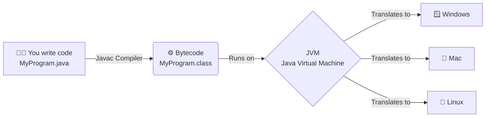

# Platform Independency in Java

 **platform independency** is the cornerstone of its design, famously encapsulated by the slogan **"Write Once, Run Anywhere" (WORA)** [cite: 1, 4]. 
 It means that a Java program written and compiled on one operating system (like Windows) can be executed on any other operating system (like macOS or Linux) without needing modifications or recompilation [cite: 4].

---
# Java Arctiture

## 1. The Two-Step Execution Process
Unlike languages such as C or C++, which are platform-dependent because they compile directly into native machine code specific to the host OS and CPU [cite: 1, 4], Java uses a two-step process to separate the code from the underlying hardware.

### Step 1: Compilation to Bytecode
When you write Java source code (`.java` files) [cite: 1] and compile it using the Java compiler (`javac`) [cite: 1], the compiler does not produce native machine code. Instead, it generates an intermediate, highly optimized set of instructions called **Bytecode** (`.class` files) [cite: 1, 4]. 

*   **Bytecode is universal:** A `.class` file generated on a Windows machine is identical down to the byte to one generated on a Linux machine [cite: 1]. The hardware does not matter at this stage [cite: 1].

### Step 2: Execution by the JVM
To run this universal bytecode, Java relies on the **Java Virtual Machine (JVM)** [cite: 1, 4]. The JVM is a software-based engine that acts as a virtual computer running inside your actual operating system [cite: 1]. 

*   When you execute a Java program, the JVM loads the `.class` files [cite: 1].
*   The JVM's internal **Execution Engine** (using an Interpreter and a Just-In-Time (JIT) Compiler) translates the universal bytecode into the specific native machine code understood by the local hardware on the fly [cite: 1, 3, 4].

## 2. The Irony: The JVM is Platform-Dependent
To achieve platform independence for your Java *code*, the runtime environment itself must be tailored to the host system. 

*   **The Code is Independent:** You only write and compile your `.java` file once [cite: 4].
*   **The JVM is Dependent:** You must download and install a specific version of the JVM designed for Windows, a different one for macOS, and a different one for Linux [cite: 4]. 

Because Oracle and the open-source community have built JVMs for virtually every operating system and hardware architecture, your standardized bytecode can run almost anywhere.

## 3. Workflow Summary

| Stage | Output | Dependency | Description |
| :--- | :--- | :--- | :--- |
| **Source** | `.java` file | Independent | Human-readable Java code written by the programmer [cite: 1]. |
| **Compiler** | `.class` file | Independent | `javac` translates source code into universal Bytecode [cite: 1]. |
| **JVM** | Machine Code | **Dependent** | Translates Bytecode into native instructions for the specific OS/CPU [cite: 1, 3]. |
----
