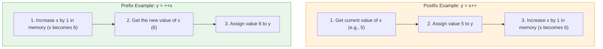

# 🚀 Java Increment and Decrement Operators

*   **Increment Operator (`++`)**: Adds `1` to a variable.
*   **Decrement Operator (`--`)**: Subtracts `1` from a variable.

Instead of writing `x = x + 1;`, you can simply write `x++;`. It saves time and makes your code look cleaner!

## 2. The Two Types: Prefix and Postfix

Here is where it gets interesting. You can put these operators *before* the variable or *after* the variable. Both will change the value by 1, but they do it at slightly different times.

### A. Postfix (After the variable)
*   **Syntax:** `variable++` or `variable--`
*   **Rule:** **"Use first, change later."** Java will use the *current* value of the variable in the statement, and *then* increase/decrease it.

### B. Prefix (Before the variable)
*   **Syntax:** `++variable` or `--variable`
*   **Rule:** **"Change first, use later."** Java will increase/decrease the variable *first*, and then use the *new* value in the statement.

---

## 3. Visualizing the Difference 👀

Let's imagine you have a box (variable `x`) with the number `5` inside.

### Example 1: Postfix (`x++`)
```java
int x = 5;
int y = x++; // Postfix
```
**What happens step-by-step:**
1. Java looks at `x` (it is 5).
2. Java gives the value `5` to `y`. **(y is now 5)**
3. Java increases `x` by 1. **(x is now 6)**

### Example 2: Prefix (`++x`)
```java
int x = 5;
int y = ++x; // Prefix
```
**What happens step-by-step:**
1. Java increases `x` by 1 right away. **(x is now 6)**
2. Java gives the *new* value `6` to `y`. **(y is now 6)**

---

## 4. Complete Code Example 💻

Copy and paste this into your Java editor to see it in action!

```java
public class OperatorsDemo {
    public static void main(String[] args) {
        
        System.out.println("--- Postfix Increment ---");
        int a = 10;
        System.out.println("Original a: " + a);       // Outputs 10
        System.out.println("Using a++ : " + (a++));   // Outputs 10 (Uses first, then adds 1)
        System.out.println("After a++ : " + a);       // Outputs 11

        System.out.println("\n--- Prefix Increment ---");
        int b = 10;
        System.out.println("Original b: " + b);       // Outputs 10
        System.out.println("Using ++b : " + (++b));   // Outputs 11 (Adds 1 first, then uses)
        System.out.println("After ++b : " + b);       // Outputs 11
        
        System.out.println("\n--- Decrement Example ---");
        int c = 5;
        System.out.println("Using c-- : " + (c--));   // Outputs 5 (then c becomes 4)
        System.out.println("Using --c : " + (--c));   // Outputs 3 (c was 4, decreases to 3, then uses)
    }
}
```
