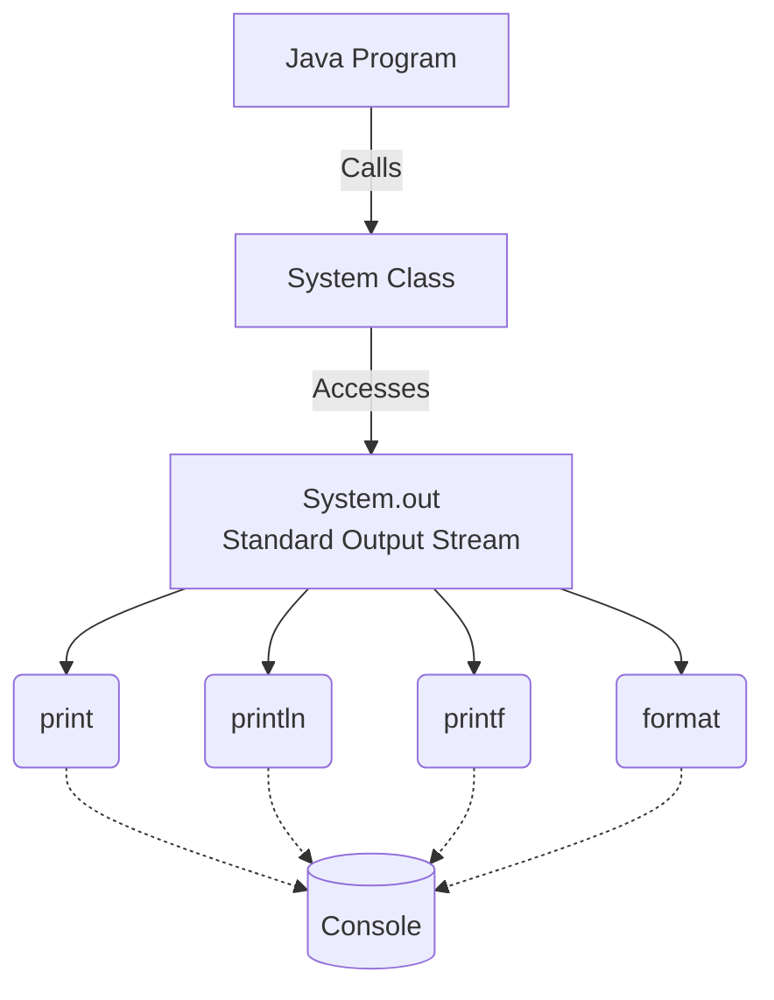
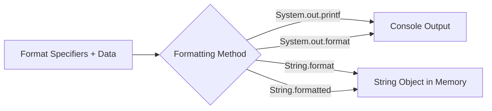

# Java Core Libraries: Output, Formatting, and Math

A comprehensive guide to standard Java library methods for console output, string formatting, and mathematical operations.

---

## 1. `System.out`

`System` is a built-in Java class, and `out` is its standard output stream (`PrintStream`). Methods such as `print()`, `println()`, `printf()`, and `format()` write output through this stream.

### Visual Breakdown



---

## 2. Main `System.out` Methods

### `System.out.println()`
Prints a value and then moves the cursor to the next line.

```java
System.out.println("Hello, buddy!");
System.out.println("Welcome to Java.");
```
**Output:**
```text
Hello, buddy!
Welcome to Java.
```

### `System.out.print()`
Prints a value without automatically moving to the next line.

```java
System.out.print("Learning ");
System.out.print("Java ");
System.out.print("is fun!");
```
**Output:**
```text
Learning Java is fun!
```

---

## 3. Formatted Output in Java

Java provides three closely related formatting approaches. The key distinction is their **destination**:



### `System.out.printf()`
`printf()` means **print formatted**. It uses format specifiers to insert and format values.

```java
String language = "Java";
int version = 21;

System.out.printf("I am learning %s version %d.%n", language, version);
```
**Output:**
```text
I am learning Java version 21.
```

### `System.out.format()`
`format()` performs the exact same kind of formatted console output as `printf()`. For `PrintStream`, it is effectively an alias.

```java
String item = "Coffee";
double price = 2.50;

System.out.format("One %s costs $%.2f.%n", item, price);
```

> **Note:** Because `printf()` and `format()` provide the same `PrintStream` formatting capability, they should be treated as one concept rather than two separate topics.

---

## 4. Format Specifiers

A **format specifier** is a placeholder beginning with `%`. It tells the formatter how an argument should be represented.

```java
System.out.printf(
    "Hello, my name is %s and I am %d years old.%n",
    "Alice",
    25
);
```

### Common Format Specifiers

| Specifier | Meaning | Commonly Used With | Example |
|:---:|---|---|---|
| `%d` | Decimal integer | `int`, `long`, `short`, `byte` | `42` |
| `%f` | Floating-point value | `float`, `double` | `3.141590` |
| `%s` | String representation | `String` and objects | `Java` |
| `%c` | Character | `char` | `A` |
| `%b` | Boolean representation | `boolean` | `true` |
| `%n` | Line separator | No argument | *(next line)* |

---

## 5. Anatomy of a Format Specifier

A format specifier can contain optional components: `%[flags][width][.precision]conversion`

**Example breakdown of `%05.2f`:**
* **`%`** - Indicates start of specifier
* **`0`** - **Flag:** zero padding
* **`5`** - **Width:** minimum 5 characters wide
* **`.2`** - **Precision:** 2 decimal places
* **`f`** - **Conversion:** floating-point

### Width & Precision Examples
```java
System.out.printf("%5d", 9);       // Width (Output: "    9")
System.out.printf("%.2f", 3.14159); // Precision (Output: "3.14")
```

### Flags

| Flag | Purpose | Example | Result |
|---|---|---|---|
| `-` | Left-align within the width | `%-5d` | `9    ` |
| `0` | Zero-pad numeric output | `%05d` | `00009` |
| `,` | Add grouping separators | `%,d` (1000000) | `1,000,000` |

---

## 6. `String.format()` & `.formatted()`

These methods use the same format-specifier rules as `printf()`, but they **return the formatted text as a `String`** instead of printing it immediately.

### `String.format()`
```java
String result = String.format("I have %d apples and %d oranges.", 5, 3);
System.out.println(result);
```

**Formatting a Table:**
```java
System.out.println(String.format("| %-10s | %10s |", "Item", "Price"));
System.out.println(String.format("| %-10s | %10.2f |", "Coffee", 3.50));
```

### Modern Java: `.formatted()`
Modern Java allows an existing string (especially Text Blocks) to be formatted directly:
```java
String email = """
        Dear %s,
        Your order number %d is confirmed.
        Total: $%.2f
        """.formatted("Alice", 1042, 59.99);
```

---

## 7. `System.in` and `System.err`

* **`System.in` (Standard Input):** Commonly associated with keyboard input. Often wrapped by `Scanner`.
  ```java
  Scanner input = new Scanner(System.in);
  int age = input.nextInt();
  ```
* **`System.err` (Standard Error):** Intended for diagnostic or error messages. IDEs typically display this stream in red.
  ```java
  System.err.println("File not found!");
  ```
* ** `System.exit(0)` → terminates the entire Java program and nothing execute after that !
---

#