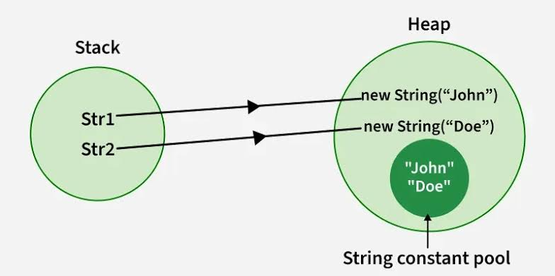

## 1. What is a String in Java? 🧵

In simple terms, a **String** is just a sequence of characters (letters, numbers, or symbols) grouped together. Think of it like a **necklace of letters**.

*   `'A'` is a single character (char).
*   `"Apple"` is a String (a sequence of chars).

**Important Rule:** In Java, a String is **not** a primitive data type (like `int` or `boolean`). It is an **Object**. Because it's an object, it has special behaviors, especially in how it uses computer memory.

---

## 2. Methods of Creating a String 🛠️

There are two main ways to create a String in Java. Both look different and, more importantly, behave differently in the computer's memory.

### Method A: Using String Literals (The Shortcut)
This is the most common and easiest way. You just put your text inside double quotes `""`.

**Syntax & Example:**
```java
// Creating a String using a literal
String name1 = "Java";
String name2 = "Java"; 
```

### Method B: Using the `new` Keyword & Constructors (The Traditional Object Way)
Because String is an Object, you can create it using the `new` keyword and a **Constructor** (a special method used to build objects).

**Syntax & Example:**
```java
// Creating a String using the 'new' keyword constructor
String name3 = new String("Java");
String emptyString = new String(); // Creates an empty string ""
```
## 1. Creating a String using a Character Array: `String(char[])` 🔠

### The Concept (The LEGO Analogy)
Think of a **`char`** (character) as a single LEGO block. It holds exactly one letter, number, or symbol (like `'H'`, `'e'`, `'!'`). 
A **`char[]`** (character array) is a box filled with these individual LEGO blocks.

When you use the `String(char[])` constructor, you are telling Java: *"Hey, take all these individual LEGO blocks from my box, snap them together in order, and build one solid piece (a String)."*

### Visual Diagram 🗺️

```text
  The char[] Array (Individual Blocks)
  +-----+-----+-----+-----+-----+
  | 'H' | 'e' | 'l' | 'l' | 'o' |
  +-----+-----+-----+-----+-----+
                 |
  String(char[]) | (Snapping them together)
                 V
           "Hello" (One solid String Object)
```

### Syntax and Code Example 💻

```java
public class CharArrayExample {
    public static void main(String[] args) {
        // 1. We start with an array of individual characters
        char[] myLetters = {'J', 'a', 'v', 'a', 'X'};
        
        // 2. We pass the array into the String constructor
        String myWord = new String(myLetters);
        
        // 3. Print the result
        System.out.println("The constructed string is: " + myWord); 
        // Output: The constructed string is: JavaX
    }
}
```

**Real-World Use Case:** Why do we use this? When dealing with **Passwords**. It is much safer to store passwords as a `char[]` while typing them. Once the user is done, we can convert it into a String to check it, or wipe the array to keep hackers from stealing it from the computer's memory!

---

## 2. Creating a String using a Byte Array: `String(byte[])` 🔢

### The Concept (The Secret Code Analogy)
Computers do not actually understand letters. They only understand numbers (0s and 1s). So, how does a computer store the letter `'A'`? It uses a secret translation code called **Character Encoding** (the most famous one is called **ASCII**).

In ASCII:
* The number `65` translates to the letter `'A'`.
* The number `97` translates to the letter `'a'`.
* The number `33` translates to `'!'`.

A **`byte`** in Java is just a small number (from -128 to 127). A **`byte[]`** is an array of these numbers.
When you use `String(byte[])`, Java takes your numbers, looks them up in its translation dictionary (like ASCII), and turns them into human-readable text!

### Visual Diagram 🗺️

```text
  The byte[] Array (Raw Numbers)
  +----+----+-----+-----+-----+
  | 72 | 101| 108 | 108 | 111 |
  +----+----+-----+-----+-----+
                 |
  String(byte[]) | (Translating using ASCII dictionary)
                 V
  +-----+-----+-----+-----+-----+
  | 'H' | 'e' | 'l' | 'l' | 'o' |
  +-----+-----+-----+-----+-----+
                 |
                 V
           "Hello" (The final String)
```

### Syntax and Code Example 💻

```java
public class ByteArrayExample {
    public static void main(String[] args) {
        // 1. We start with an array of bytes (numbers representing ASCII codes)
        // 72='H', 101='e', 108='l', 108='l', 111='o'
        byte[] secretCodes = {72, 101, 108, 108, 111};
        
        // 2. We pass the byte array into the String constructor
        String decodedMessage = new String(secretCodes);
        
        // 3. Print the result
        System.out.println("The decoded string is: " + decodedMessage); 
        // Output: The decoded string is: Hello
    }
}
```
*  #### we can use **String str = new String(secretCoded,1,3);**
*  *for creating string wehre first argument gets the array , second as form which index the input will start , and third argument takes that how my indexes do you want to make a string.*
---

## 3. The Big Secret: How Java Stores Strings in Memory 🧠

This is where interviewers love to test you! To understand Strings, you must understand Java's memory structure. 

Java's memory has a large area called the **Heap**. Think of the Heap as a massive warehouse where all Java Objects are stored. Inside this big warehouse, Java built a special, exclusive VIP room just for Strings. This VIP room is called the **String Constant Pool (SCP)**.

### Visual Diagram: The Memory Layout 🗺️

```text
======================================================
||                  HEAP MEMORY (The Warehouse)     ||
||                                                  ||
||   [ name3 ] ---->  Object("Java")                ||
||                    (Standard Heap Area)          ||
||                                                  ||
||       ====================================       ||
||       ||    STRING CONSTANT POOL (VIP)  ||       ||
||       ||                                ||       ||
||       ||   "Java" <---- [ name1 ]       ||       ||
||       ||     ^                          ||       ||
||       ||     |                          ||       ||
||       ||     ---------- [ name2 ]       ||       ||
||       ====================================       ||
======================================================
```



### What happens when you use a Literal (`String name1 = "Java";`)?
1. Java looks inside the **String Constant Pool (VIP room)**.
2. It asks: *"Does the word 'Java' already exist here?"*
3. If **NO**: It creates "Java" in the pool and points `name1` to it.
4. If **YES**: It does *not* create a new word. It simply points your new variable (`name2`) to the already existing "Java". 
   * **Result:** `name1` and `name2` share the exact same memory location! This saves a lot of computer memory.

### What happens when you use `new` (`String name3 = new String("Java");`)?
1. The `new` keyword acts like a stubborn boss. It forces Java to create a **brand new object** in the main **Heap Memory** (outside the VIP pool), no matter what!
2. Even though "Java" already exists in the pool, `name3` gets its own entirely separate space in the regular Heap.
   * **Result:** `name3` does not share memory with `name1` or `name2`, even though they contain the exact same letters.

---

## 4. Proving the Memory Locations: The `==` vs `.equals()` Test ⚖️

To prove this memory concept, we need to understand how to compare Strings. 

*   `==` operator: Checks if two variables point to the **exact same memory location**.
*   `.equals()` method: Checks if the **actual letters/text** are the same.

### Code Example:
```java
public class StringMemoryTest {
    public static void main(String[] args) {
        
        // Created using Literals (Goes to String Pool)
        String s1 = "Hello";
        String s2 = "Hello";
        
        // Created using 'new' (Goes to regular Heap)
        String s3 = new String("Hello");

        System.out.println("--- Comparing with == (Memory Check) ---");
        System.out.println(s1 == s2); // TRUE! They share the same memory in the Pool.
        System.out.println(s1 == s3); // FALSE! s3 is a completely different object in the Heap.

        System.out.println("\n--- Comparing with .equals() (Text Check) ---");
        System.out.println(s1.equals(s2)); // TRUE! Both say "Hello"
        System.out.println(s1.equals(s3)); // TRUE! Both say "Hello", even if memory is different.
    }
}
```

---

## 5. Immutability🔒 of String.

You might ask: *"If `s1` and `s2` share the same memory, what happens if I change `s1`? Will `s2` change too?"*

**Answer:** No! Because Strings in Java are **Immutable** (Unchangeable).

Once a String is created in memory, its text can **never be changed**. If you try to modify it, Java just creates a completely new String in the background.
