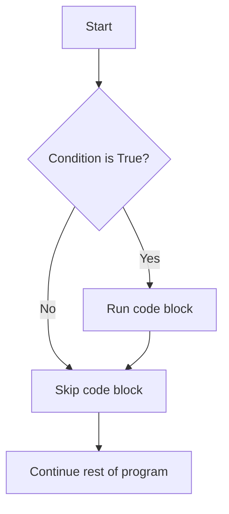
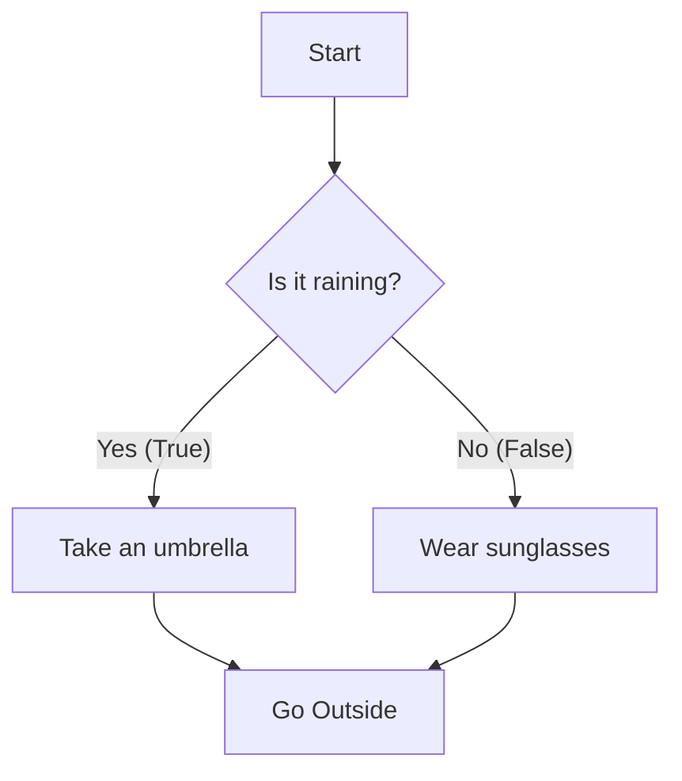

# Java Conditional Statements:.

## 1. The `if` Statement
The `if` statement is the simplest condition. It tells Java: *"Execute this block of code **only if** a certain condition is True."*

### 🧠 Visualizing the `if` statement



### 📝 Syntax
```java
if (condition) {
    // Code to run if condition is true
}
```

### 💻 Example
```java
public class Main {
    public static void main(String[] args) {
        int age = 18;
        
        // Check if the person is 18 or older
        if (age >= 18) {
            System.out.println("You are old enough to vote!");
        }
        
        System.out.println("Program continues...");
    }
}
```
*Because `age` is exactly 18, the condition (`age >= 18`) is true, so it prints the voting message.*

---

## 2. The `if-else` Statement
What if we want one thing to happen if the condition is True, and a **different** thing to happen if it's False? We use `if-else`.

### 🧠 Visualizing `if-else`



### 📝 Syntax
```java
if (condition) {
    // Code to run if condition is True
} else {
    // Code to run if condition is False
}
```

### 💻 Example
```java
public class Main {
    public static void main(String[] args) {
        int studentScore = 45;
        
        if (studentScore >= 50) {
            System.out.println("Congratulations, you passed!");
        } else {
            System.out.println("Sorry, you failed. Try again.");
        }
    }
}
```
*Since 45 is not greater than or equal to 50, the `else` block runs, printing "Sorry, you failed."*

---

## 3. The `if-else-if` Ladder
Sometimes you have more than two options. For example, assigning a grade (A, B, C, D) based on a score. We use an `if-else-if` ladder.

### 📝 Syntax
```java
if (condition1) {
    // Runs if condition1 is true
} else if (condition2) {
    // Runs if condition2 is true
} else {
    // Runs if NO conditions were true
}
```

### 💻 Example
```java
public class Main {
    public static void main(String[] args) {
        int time = 14; // 14:00 or 2 PM
        
        if (time < 12) {
            System.out.println("Good Morning!");
        } else if (time < 17) {
            System.out.println("Good Afternoon!");
        } else {
            System.out.println("Good Evening!");
        }
    }
}
```
*Java checks top-to-bottom. 14 is not less than 12. But 14 IS less than 17, so it prints "Good Afternoon!" and skips the rest.*

---

## 4. The `switch` Statement
When you have a single variable that you want to check against many specific values (like days of the week or menu options), the `switch` statement is cleaner than a long `if-else-if` ladder.

### 🧠 Visualizing `switch`
Imagine a train track switching paths depending on the ticket number.
* Ticket 1 -> Path 1
* Ticket 2 -> Path 2
* Ticket 3 -> Path 3

### 📝 Syntax
```java
switch(variable) {
  case value1:
    // Code
    break; // VERY IMPORTANT: Stops it from running the next cases
  case value2:
    // Code
    break;
  default:
    // Runs if no cases match (like the 'else' block)
}
```

### 💻 Example
```java
public class Main {
    public static void main(String[] args) {
        int dayOfWeek = 3;
        
        switch (dayOfWeek) {
            case 1:
                System.out.println("Monday");
                break;
            case 2:
                System.out.println("Tuesday");
                break;
            case 3:
                System.out.println("Wednesday");
                break;
            default:
                System.out.println("Weekend or Invalid Day");
        }
    }
}
```
*It prints "Wednesday". If we forget the `break;`, Java will keep running the code for the cases below it!*
* Inside the cases only **byte,short,int , char, string** type of data is allowed !
* You cann't assign **case1.1** . Since it does not support float values.
* It take small time to check conditions as compare to conditonals.
* it is very useful in conditions of manual driven program.

*  **FallThrough** is a sitution where each cases are executed where "break" is not applied.
---

