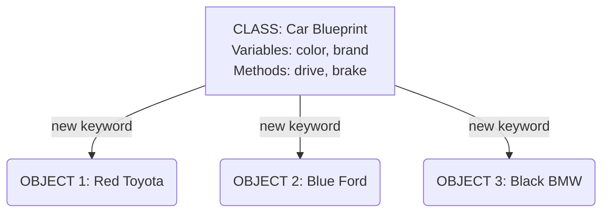

## 1. The Core Analogy: The Blueprint and The House

Imagine you want to build a house. 
* First, an architect draws a **blueprint** (a paper design). 
* The blueprint is *not* a real house. You can't live in it. It just tells you how the house should look, how many doors it has, and what color it is.
* Using that single blueprint, a builder can build **many real houses**. 

In Java:
* The **Class** is the blueprint.
* The **Object** is the real house.

### 🖼️ Visualizing the Concept


*(In the diagram above, you can see how one single "Car" blueprint is used to create three completely different real cars!)*

---

# 2. What is a Class? 

A **Class** is a template or a blueprint for creating objects. It defines two main things for the objects it will create:
1. **State (Attributes/Fields):** What the object *knows* or *has* (e.g., color, name, age). In code, we call these **Variables**.
2. **Behavior (Methods):** What the object *does* (e.g., run, eat, sleep). In code, we call these **Methods**.

### 💻 Syntax of a Class
```java
// We use the keyword "class" to define it
public class Car {
    
    // 1. State (Fields/Variables) - What the car HAS
    String brand;
    String color;
    int year;

    // 2. Behavior (Methods) - What the car DOES
    public void startEngine() {
        System.out.println("Vroom! The engine started.");
    }
    
    public void drive() {
        System.out.println("The car is moving.");
    }
}
```

---

# 3. What is an Object?

An **Object** is a real-world entity created from a class. Creating an object from a class is called **instantiation** (making an instance).

To create an object in Java, we use a special magic word: `new`.

### 💻 Syntax of creating an Object
```java
// ClassName objectName = new ClassName();
Car myFirstCar = new Car(); 
```

Once you create the object, you can use a **dot (`.`)** to access its properties (state) and actions (behavior).

---


## 4. Putting it All Together (Full Working Example)

Let's look at a complete, working Java program. We will create a `Dog` blueprint, and then create two actual dogs.

```java
// 1. We define our Blueprint (Class)
class Dog {
    // State (Variables)
    String name;
    String breed;
    int age;

    // Behavior (Methods)
    public void bark() {
        System.out.println(name + " says: Woof! Woof!");
    }

    public void eat() {
        System.out.println(name + " is eating dog food.");
    }
}

// 2. We use the Blueprint in our Main class
public class Main {
    public static void main(String[] args) {
        
        // Creating the FIRST object using the 'new' keyword
        Dog dog1 = new Dog();
        
        // Using the dot (.) to set the dog's properties
        dog1.name = "Buddy";
        dog1.breed = "Golden Retriever";
        dog1.age = 3;

        // Creating the SECOND object
        Dog dog2 = new Dog();
        dog2.name = "Max";
        dog2.breed = "Bulldog";
        dog2.age = 5;

        // Making them do things (Calling methods)
        dog1.bark(); // Output: Buddy says: Woof! Woof!
        dog2.eat();  // Output: Max is eating dog food.
    }
}
```

---
## 5. Related Important Topics

To fully master Classes and Objects, you should know these closely related concepts:

### A. The `new` Keyword & Memory Allocation
When you type `new Dog()`, Java goes into your computer's memory (RAM), carves out a fresh, empty block of space for a new dog, and hands you a "reference" (think of it like a remote control) to that space. Without `new`, there is no real object, just an empty remote control.

### B. Constructors
Notice how we had to set `dog1.name = "Buddy";` on a separate line *after* creating the dog? 
A **Constructor** is a special method that lets you set these values *at the exact moment* you create the object, saving time and code.

*Example of a Constructor:*
```java
class Dog {
    String name;

    // This is a constructor! It always has the exact same name as the class.
    public Dog(String dogName) { 
        name = dogName; // Set the name immediately
    }
}

// Now we can create and name the dog in one single line!
Dog dog3 = new Dog("Charlie");
```

### C. Instance Variables vs. Local Variables
* **Instance Variables:** Variables defined *inside* the class but *outside* any method (like `name` and `age` above). Every single object you create gets its very own copy of these variables. 
* **Local Variables:** Variables defined *inside* a method. They disappear as soon as the method finishes running. They belong to the method, not the object.


---

## 🎯 Summary Checklist
- [x] **Class:** The blueprint, template, or design.
- [x] **Object:** The actual physical thing created from the blueprint.
- [x] **State:** Variables/Fields (What it is / What it has).
- [x] **Behavior:** Methods (What it does).
- [x] **`new` keyword:** The magic word used to bring an object to life in memory.

---
# Printing Objects in Java: The Magic of `toString()`


Have you ever tried to print an object and gotten a weird, ugly result like `Dog@7852e922`? Let's understand why that happens and how the `toString()` method fixes it.

---

## 1. The Problem: Printing an Object directly

Imagine we have a simple `Dog` class, and we try to print a `Dog` object.

```java
class Dog {
    String name = "Buddy";
    int age = 3;
}

public class Main {
    public static void main(String[] args) {
        Dog myDog = new Dog();
        
        // Let's try to print the object itself!
        System.out.println(myDog); 
    }
}
```

**What you expect to see:** Something like "Buddy, 3 years old"
**What Java actually prints:** `Dog@7852e922` (Wait, what is that?!)

### Why does this happen?
Java doesn't automatically know *how* you want to display your object. Should it print the name? The age? Both? Because Java is confused, it prints a default generic label: the **Class Name** followed by an `@` symbol and a **memory hash code** (like a serial number).

---

## 2. The Solution: The `toString()` Method

To tell Java exactly how to print our object, we must provide a special method called `toString()`. 

Whenever you write `System.out.println(myDog);`, Java silently goes to your `Dog` class and asks, *"Do you have a `toString()` method?"* If yes, it runs it!

Let's fix our code:

```java
class Dog {
    String name = "Buddy";
    int age = 3;
    
    // We are creating our own rules for printing!
    @Override
    public String toString() {
        return "Dog's Name: " + name + ", Age: " + age;
    }
}

public class Main {
    public static void main(String[] args) {
        Dog myDog = new Dog();
        
        // Now, this will look beautiful!
        System.out.println(myDog); 
    }
}
```

**New Output:** `Dog's Name: Buddy, Age: 3`

---

## 3. Visual Diagram: How Java Prints Objects

Here is a visual showing what happens inside Java's brain when you use `System.out.println()`.

```text
 __________________________________________________________________
|                   System.out.println(myDog);                     |
|__________________________________________________________________|
                              |
                              V
       Java asks: "Does the Dog class have a toString() method?"
                              |
             +----------------+----------------+
             |                                 |
        [ YES ]                           [ NO ]
             |                                 |
             V                                 V
 +-------------------------+       +------------------------------+
 | Java runs YOUR custom   |       | Java panics and uses the     |
 | toString() method.      |       | default generic label.       |
 |                         |       |                              |
 | OUTPUT:                 |       | OUTPUT:                      |
 | "Dog's Name: Buddy..."  |       | Dog@7852e922                 |
 +-------------------------+       +------------------------------+
```

---

## 4. Related Important Topics to Explore Next

To deeply understand `toString()`, there are two background concepts happening here like magic:

1.  **The Master Class (`Object`):** In Java, there is a master class called `Object`. EVERY class you ever write (like `Dog` or `Car`) secretly inherits from this master class. The master `Object` class is the one that originally provides a basic, ugly `toString()` method.
2.  **Method Overriding (`@Override`):** Did you notice the `@Override` tag in the code above? Because the master `Object` class already gave us a bad `toString()` method, we are **overriding** (crushing/replacing) it with our own beautiful version. 

**Summary:** If you want to print an object and make it readable for humans, always write a `toString()` method inside your class! 

Would you like to dive deeper into **Inheritance (The Master Object Class)** or **Method Overriding** next?