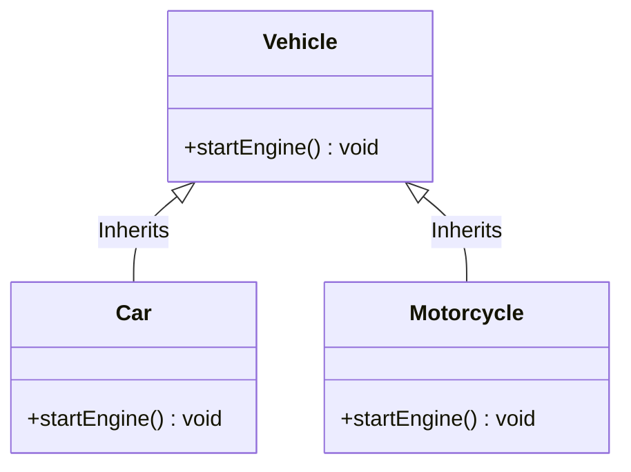

# Java Method Overriding: A Beginner's Guide


## 1. What is Method Overriding?

Imagine you have a basic **Mobile Phone** from 2005. It has a feature called `playMusic()`. When you use it, it plays a simple polyphonic ringtone. 

Now, imagine a modern **Smartphone**. It is still a mobile phone, so it inherits the `playMusic()` feature. But when you use it, it opens Spotify and plays high-quality audio. The modern smartphone has **overridden** the old way of playing music with a new, better way.

In Java, **Method Overriding** happens when a Child class (Subclass) provides a specific implementation for a method that is already present in its Parent class (Superclass).

### The Golden Rule
For overriding to happen, the method in the child class must have the **exact same name** and the **same parameters** as the method in the parent class.

---

## 2. Visualizing Method Overriding

Here is a diagram showing how a Parent class shares its method, and how the Child classes override it to do their own specific things.



*   `Vehicle` is the Parent class with a method `startEngine()`.
*   `Car` and `Motorcycle` are Child classes. They inherit from `Vehicle`, but they **override** the `startEngine()` method because a car starts differently than a motorcycle.

---

## 3. Syntax and Code Example

Let's look at how this is written in Java code.

```java
// 1. The Parent Class
class Vehicle {
    // Parent method
    public void startEngine() {
        System.out.println("The vehicle engine is starting...");
    }
}

// 2. The Child Class (Car)
class Car extends Vehicle {
    // Overriding the parent's method
    @Override
    public void startEngine() {
        System.out.println("Car engine starts with a push button: Vroom Vroom!");
    }
}

// 3. The Child Class (Motorcycle)
class Motorcycle extends Vehicle {
    // Overriding the parent's method
    @Override
    public void startEngine() {
        System.out.println("Motorcycle engine starts with a kick: Bang Bang!");
    }
}

// 4. The Main Class (To test our code)
public class Main {
    public static void main(String[] args) {
        // Creating a generic Vehicle
        Vehicle myVehicle = new Vehicle();
        myVehicle.startEngine(); // Output: The vehicle engine is starting...

        // Creating a Car
        Car myCar = new Car();
        myCar.startEngine();    // Output: Car engine starts with a push button: Vroom Vroom!

        // Creating a Motorcycle
        Motorcycle myBike = new Motorcycle();
        myBike.startEngine();   // Output: Motorcycle engine starts with a kick: Bang Bang!
    }
}
```

### What is `@Override`?
You see `@Override` written above the methods in the child classes. This is a label (called an annotation) for the Java compiler. It says, *"I am trying to override a parent method. If I made a spelling mistake, please give me a red error!"* It is a best practice to always use it.

---

## 4. Important Rules for Overriding

To be a great Java developer, remember these rules:
1.  **Must use Inheritance:** You can only override methods between classes connected by `extends` (Parent and Child).
2.  **Exact Match:** The method name, return type, and parameters must be exactly the same.
3.  **Cannot override `private` methods:** Private things belong only to that specific class. The child cannot see them, so it cannot override them.
4.  **Cannot override `final` methods:** If a parent puts the word `final` on a method, it means "nobody can change this."

---

## 5. Related Topic 1: Overriding vs. Overloading

In interviews, they always ask the difference between **Overriding** and **Overloading**. Here is a simple table to help you remember:

| Feature | Method Overriding | Method Overloading |
| :--- | :--- | :--- |
| **Where does it happen?** | Between **two different classes** (Parent and Child). | Inside the **same single class**. |
| **Method Name** | Must be the SAME. | Must be the SAME. |
| **Parameters** | Must be EXACTLY THE SAME. | Must be **DIFFERENT** (different number or types). |
| **What does it do?** | Changes the behavior of an inherited method. | Creates multiple versions of a method to handle different data. |

---

## 6. Related Topic 2: The `super` Keyword

What if you want to use the Parent's original code, but *also* add some new code of your own? You use the `super` keyword! `super` tells Java to look at the parent class.

```java
class SmartCar extends Car {
    @Override
    public void startEngine() {
        // 1. Call the parent class's method first using "super"
        super.startEngine(); 
        
        // 2. Add extra child-specific behavior
        System.out.println("Connecting to Bluetooth and turning on AC...");
    }
}
```

### Summary
Method Overriding is the heart of making flexible code in Java. It allows a child class to take an existing method from its parent and customize it to do exactly what the child needs!