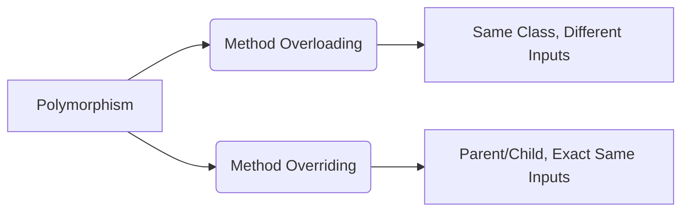

# Polymorphism 

**Polymorphism** is a big word that simply means **"many forms."** It allows one action (like a method) to behave differently based on the situation. 

Java achieves this in two ways:

---

## 1. Compile-Time Polymorphism (Method Overloading)
This happens when you have multiple methods with the **same name** but **different parameters** inside the *same class*. 

Java decides which method to run while compiling the code, based on the data you provide.

### The Code Example:
```java
class Calculator {
    // Form 1: Add two numbers
    public void add(int a, int b) {
        System.out.println(a + b);
    }
    
    // Form 2: Add three numbers (Overloaded)
    public void add(int a, int b, int c) {
        System.out.println(a + b + c);
    }
}
```
**Why it's Polymorphism:** The single action `add` takes multiple forms depending on how many numbers you give it.

---

## 2. Runtime Polymorphism (Method Overriding)
This happens when a **Child class** gives its own specific code to a method inherited from a **Parent class**. The method name and parameters stay *exactly the same*.

Java waits until the program is running (runtime) to look at the *actual object* and decide which method to use.

### The Code Example:
```java
class Animal {
    public void makeSound() {
        System.out.println("Generic sound...");
    }
}

class Dog extends Animal {
    @Override
    public void makeSound() {
        System.out.println("Woof!");
    }
}
```
**Why it's Polymorphism:** If you write `Animal myPet = new Dog();` and call `myPet.makeSound()`, Java dynamically runs the Dog's version. The generic `Animal` action took the specific form of a `Dog`.

---

## Quick Comparison Table

| Feature | Overloading | Overriding |
| :--- | :--- | :--- |
| **Type of Polymorphism** | Compile-Time (Static) | Run-Time (Dynamic) |
| **Where it happens** | Same Class | Parent & Child Classes |
| **Method Name** | Same | Same |
| **Parameters** | **Different** | **Same** |

