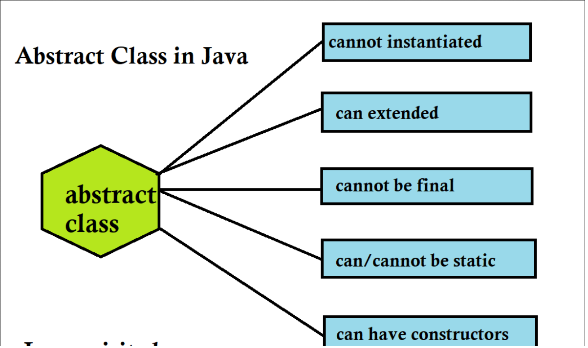

# Understanding Abstract Classes in Java


## 1. What is an Abstract Class?

Imagine you are drawing a generic "Shape." Can you draw exactly what a "Shape" looks like? No. You can draw a Circle, a Square, or a Triangle, but a generic "Shape" is just a concept or an idea.

In Java, an **Abstract Class** is a class that represents a general concept. It is a restricted class that **cannot be used to create objects directly**. It serves as a **blueprint** or template for other classes.

To use an abstract class, another class must **inherit** (extend) it and fill in the missing details.

### The Two Golden Rules:
1. You **cannot** create an object of an abstract class using the `new` keyword (e.g., `Shape s = new Shape();` will give an error).
2. It is meant to be a parent class for other child classes.


---

## 2. Visualizing Abstract Classes

Let's look at a diagram to understand how an Abstract Class connects with regular (concrete) classes.

```text
               +-----------------------------------+
               |     << Abstract Class >>          |
               |          VEHICLE                  |
               +-----------------------------------+
               | + brand: String                   |  <-- Regular variable
               | + honk(): void                    |  <-- Regular method (has a body)
               | + drive(): void << abstract >>    |  <-- Abstract method (no body!)
               +-----------------------------------+
                                 ^
                                 | (Inherits / extends)
                                 |
            +--------------------+--------------------+
            |                                         |
+-------------------------+               +-------------------------+
|     << Class >>         |               |      << Class >>        |
|         CAR             |               |      MOTORCYCLE         |
+-------------------------+               +-------------------------+
| + drive(): void         |               | + drive(): void         |
|   (Provides Car logic)  |               |   (Provides Bike logic) |
+-------------------------+               +-------------------------+
```

### What are Abstract Methods?
Notice the `drive()` method in the `Vehicle` box. It is marked as `abstract`. 
An **abstract method** is a method that has **no body** (no curly braces `{}`). It just has a name and a semicolon. The child class (like Car or Motorcycle) **must** provide the actual code (body) for this method.

---

## 3. Syntax and Example Code

Let's translate our visual diagram into actual Java code.

### Step 1: Create the Abstract Class (`Vehicle.java`)
```java
// We use the keyword 'abstract' to define the class
public abstract class Vehicle {
    
    // Regular variable
    String brand = "Ford";
    
    // Regular method - it has a body { }
    public void honk() {
        System.out.println("Beep beep!");
    }
    
    // Abstract method - NO body, ends with a semicolon ;
    // We don't know how a generic vehicle drives, so we leave it blank!
    public abstract void drive(); 
}
```

### Step 2: Create a Child Class (`Car.java`)
```java
// 'extends' is the keyword used to inherit from the abstract class
public class Car extends Vehicle {
    
    // The child class MUST provide the body for the abstract method!
    // This is called "Method Overriding"
    @Override
    public void drive() {
        System.out.println("The car is driving on 4 wheels safely.");
    }
}
```

### Step 3: Test the Code (`Main.java`)
```java
public class Main {
    public static void main(String[] args) {
        
        // Vehicle myVehicle = new Vehicle();  <-- ERROR! Cannot do this.

        // Create an object of the child class 'Car'
        Car myCar = new Car(); 
        
        // We can use the regular method inherited from the abstract class
        myCar.honk();  // Output: Beep beep!
        System.out.println(myCar.brand); // Output: Ford
        
        // We use the method that the Car class provided
        myCar.drive(); // Output: The car is driving on 4 wheels safely.
    }
}
```

---


## 4. Why Do We Need Abstract Classes?

You might ask, *"Why not just make a normal class? "*

1. **Safety:** It prevents developers from accidentally creating objects of generic, incomplete concepts (like trying to buy a generic "Vehicle" at a dealership).
2. **Code Reusability:** You can write common code (like the `honk()` method) once in the abstract class, and all child classes get it automatically.
3. **Strict Rules (Contracts):** By creating an abstract method like `drive()`, you force every child class to create their own `drive()` method. You guarantee that every Vehicle in your system will have a way to drive.

---

## 5. Related Important Topics

To fully master abstract classes, you should know these related concepts:

### A. Inheritance (`extends`)
This is the mechanism where one class acquires the properties (methods and fields) of another. Abstract classes rely entirely on inheritance because they cannot be used on their own.

### B. Method Overriding (`@Override`)
When a child class provides the specific implementation (the body) for an abstract method that was declared in the parent class, it is called **overriding**.

### C. Interfaces (The Next Step)
An **Interface** in Java is similar to an abstract class, but with stricter rules. In an abstract class, you can have both regular methods (with bodies) and abstract methods. In a standard Interface, *all* methods are abstract (though newer versions of Java have changed this slightly). A class can extend only **one** abstract class, but it can implement **many** interfaces.