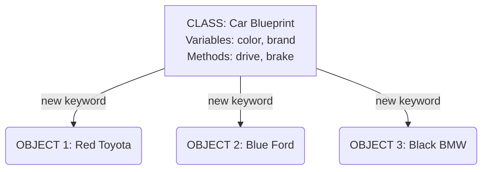

## 1. The Core Analogy: The Blueprint and The House

Imagine you want to build a house. 
* First, an architect draws a **blueprint** (a paper design). 
* The blueprint is *not* a real house. You can't live in it. It just tells you how the house should look, how many doors it has, and what color it is.
* Using that single blueprint, a builder can build **many real houses**. 

In Java:
* The **Class** is the blueprint.
* The **Object** is the real house.

### 🖼️ Visualizing the Concept


*(In the diagram above, you can see how one single "Car" blueprint is used to create three completely different real cars!)*

---

# 2. What is a Class? 

A **Class** is a template or a blueprint for creating objects. It defines two main things for the objects it will create:
1. **State (Attributes/Fields):** What the object *knows* or *has* (e.g., color, name, age). In code, we call these **Variables**.
2. **Behavior (Methods):** What the object *does* (e.g., run, eat, sleep). In code, we call these **Methods**.

### 💻 Syntax of a Class
```java
// We use the keyword "class" to define it
public class Car {
    
    // 1. State (Fields/Variables) - What the car HAS
    String brand;
    String color;
    int year;

    // 2. Behavior (Methods) - What the car DOES
    public void startEngine() {
        System.out.println("Vroom! The engine started.");
    }
    
    public void drive() {
        System.out.println("The car is moving.");
    }
}
```

---

# 3. What is an Object?

An **Object** is a real-world entity created from a class. Creating an object from a class is called **instantiation** (making an instance).

To create an object in Java, we use a special magic word: `new`.

### 💻 Syntax of creating an Object
```java
// ClassName objectName = new ClassName();
Car myFirstCar = new Car(); 
```

Once you create the object, you can use a **dot (`.`)** to access its properties (state) and actions (behavior).

---


## 4. Putting it All Together (Full Working Example)

Let's look at a complete, working Java program. We will create a `Dog` blueprint, and then create two actual dogs.

```java
// 1. We define our Blueprint (Class)
class Dog {
    // State (Variables)
    String name;
    String breed;
    int age;

    // Behavior (Methods)
    public void bark() {
        System.out.println(name + " says: Woof! Woof!");
    }

    public void eat() {
        System.out.println(name + " is eating dog food.");
    }
}

// 2. We use the Blueprint in our Main class
public class Main {
    public static void main(String[] args) {
        
        // Creating the FIRST object using the 'new' keyword
        Dog dog1 = new Dog();
        
        // Using the dot (.) to set the dog's properties
        dog1.name = "Buddy";
        dog1.breed = "Golden Retriever";
        dog1.age = 3;

        // Creating the SECOND object
        Dog dog2 = new Dog();
        dog2.name = "Max";
        dog2.breed = "Bulldog";
        dog2.age = 5;

        // Making them do things (Calling methods)
        dog1.bark(); // Output: Buddy says: Woof! Woof!
        dog2.eat();  // Output: Max is eating dog food.
    }
}
```

---
## 5. Related Important Topics

To fully master Classes and Objects, you should know these closely related concepts:

### A. The `new` Keyword & Memory Allocation
When you type `new Dog()`, Java goes into your computer's memory (RAM), carves out a fresh, empty block of space for a new dog, and hands you a "reference" (think of it like a remote control) to that space. Without `new`, there is no real object, just an empty remote control.

### B. Constructors
Notice how we had to set `dog1.name = "Buddy";` on a separate line *after* creating the dog? 
A **Constructor** is a special method that lets you set these values *at the exact moment* you create the object, saving time and code.

*Example of a Constructor:*
```java
class Dog {
    String name;

    // This is a constructor! It always has the exact same name as the class.
    public Dog(String dogName) { 
        name = dogName; // Set the name immediately
    }
}

// Now we can create and name the dog in one single line!
Dog dog3 = new Dog("Charlie");
```

### C. Instance Variables vs. Local Variables
* **Instance Variables:** Variables defined *inside* the class but *outside* any method (like `name` and `age` above). Every single object you create gets its very own copy of these variables. 
* **Local Variables:** Variables defined *inside* a method. They disappear as soon as the method finishes running. They belong to the method, not the object.

---


Conversation with Gemini
explain how does object and class looks in memory in md file , with digram and picture

Java Instructor
Custom Gem
Let's break down the magic line: Car myCar = new Car();

Car myCar: This creates a reference variable (a remote control) named myCar in the Stack Memory.

new Car(): This builds the actual physical object in the Heap Memory.

=: This links the remote control (myCar) to the physical object.

4. Visual Diagram: How it looks in Memory!
Let's visualize exactly what happens in memory after our code runs.

Plaintext
 ______________________        ___________________________       _________________________
|     STACK MEMORY     |      |       HEAP MEMORY         |     |      METHOD AREA        |
| (Remote Controls)    |      | (The Actual Objects)      |     | (The Class Blueprints)  |
|______________________|      |___________________________|     |_________________________|
|                      |      |                           |     |                         |
| [main() method]      |      |      [Car Object]         |     |       [Car Class]       |
|                      |      |  +---------------------+  |     |  +-------------------+  |
|  myCar (Reference)   |======|=>| speed: 100          |  |     |  | - int speed       |  |
|  [Address: 0x999]    |      |  | color: "Red"        |  |     |  | - String color    |  |
|                      |      |  | Type : Car          |========|=>| - void drive()    |  |
|                      |      |  +---------------------+  |     |  +-------------------+  |
|                      |      |    (Address: 0x999)       |     |                         |
|______________________|      |___________________________|     |_________________________|
Explanation of the Diagram:
In the Method Area: Java loads the Car class blueprint. It knows a car should have a speed, a color, and a drive() method. The actual code for drive() is stored here.

In the Heap Memory: The new Car() command allocates a block of memory. It creates empty slots for speed and color. We then filled them with 100 and "Red". Notice that the object itself has a hidden link back to its blueprint in the Method Area!

In the Stack Memory: The variable myCar is just storing a memory address (like 0x999). It acts like a remote control pointing to the TV (the object) in the Heap.

5. What if we create another Object?
Java
Car yourCar = new Car();
yourCar.speed = 80;
yourCar.color = "Blue";
If we add this code, here is what changes:

The Method Area stays exactly the same (we still only have ONE blueprint).

The Heap Memory gets a BRAND NEW block for yourCar with its own separate speed and color.

The Stack Memory gets a new remote control called yourCar pointing to the new object.

Plaintext
STACK: [myCar] -------> HEAP: [Car Object: Red, 100] ----> METHOD AREA: [Car Class Code]
STACK: [yourCar] -----> HEAP: [Car Object: Blue, 80] ----/ 
(Both objects share the same method code in the Method Area to save memory!)

6. Related Important Topics to Explore Next
Since you are a beginner, here are the next topics related to this memory model that you should look into:

Garbage Collection (GC): What happens if we destroy the remote control? (e.g., myCar = null;). The object in the Heap is left without a remote. Java has an automatic "Garbage Collector" that cleans up these orphaned objects to free up memory!

Pass by Value: In Java, when you pass an object to a method, you are actually passing a copy of the remote control (the reference address), not the object itself.

Static vs. Instance Variables:

Instance variables (like speed and color) go in the Heap (every car gets its own).

Static variables (e.g., static int numberOfWheels = 4;) go in the Method Area (all cars share the exact same variable).

Summary
Classes live in the Method Area (Blueprints).

Objects live in the Heap (The actual creations).

References live in the Stack (The remote controls pointing to the creations).

Keep practicing, and don't hesitate to ask if you want me to explain Garbage Collection or Static variables next! Happy Coding!
"""

with open("java_memory_model.md", "w") as f:
f.write(markdown_content)

print("File generated successfully: java_memory_model.md")


```text?code_stdout&code_event_index=1
File generated successfully: java_memory_model.md

Your Markdown file is ready

MD icon
java_memory_model
 MD 
I have created a detailed markdown file explaining how Classes and Objects look in Java memory. It includes real-world analogies, simplified JVM memory concepts (Heap, Stack, Method Area), clear visual diagrams, code examples, and related topics perfect for a beginner.

Let me know if you would like me to explain any of the related topics (like Garbage Collection or Static variables) next!

explain with digram !

Java Instructor
Custom Gem
Understanding how Java stores classes and objects in memory is the foundation of writing efficient code. Think of it like knowing how an engine works instead of just memorizing how to steer.

1. The Real-World Analogy
Class (The Blueprint): An architect's floor plan. You cannot live inside a blueprint, but it dictates exactly how the house will look.

Object (The Real House): The physical building created from that blueprint. You can build multiple houses from one blueprint.

2. The Java Memory "Rooms" (JVM Memory)
When your Java program runs, the Java Virtual Machine (JVM) divides your computer's RAM into distinct areas.

Method Area (Metaspace): The "Filing Cabinet." Java stores the Class blueprints here. It only keeps one copy of the blueprint, regardless of how many objects you create.

Heap Memory: The "Construction Site." This massive open space is where Java builds the actual Objects.

Stack Memory: The "Remote Control Room." This is where Java tracks your running methods and Reference Variables (the remote controls that point to the objects in the Heap).

3. Code Example & Memory Breakdown
Java
class Car {
    int speed;
    String color;
    
    void drive() {
        System.out.println("Driving at " + speed);
    }
}

public class Main {
    public static void main(String[] args) {
        // Creating the object and linking it to a reference
        Car myCar = new Car(); 
        
        myCar.speed = 100;
        myCar.color = "Red";
    }
}
Let's break down Car myCar = new Car();:

Car myCar: Creates a reference variable named myCar in the Stack Memory.

new Car(): Allocates physical space for the object in the Heap Memory.

=: Links the remote control (myCar) to the physical object's memory address.

4. Visual Memory Diagram
Plaintext
 ______________________        ___________________________       _________________________
|     STACK MEMORY     |      |       HEAP MEMORY         |     |      METHOD AREA        |
| (Remote Controls)    |      | (The Actual Objects)      |     | (The Class Blueprints)  |
|______________________|      |___________________________|     |_________________________|
|                      |      |                           |     |                         |
| [main() method]      |      |      [Car Object]         |     |       [Car Class]       |
|                      |      |  +---------------------+  |     |  +-------------------+  |
|  myCar (Reference)   |======|=>| speed: 100          |  |     |  | - int speed       |  |
|  [Address: 0x999]    |      |  | color: "Red"        |  |     |  | - String color    |  |
|                      |      |  | Type : Car          |========|=>| - void drive()    |  |
|                      |      |  +---------------------+  |     |  +-------------------+  |
|                      |      |    (Address: 0x999)       |     |                         |
|______________________|      |___________________________|     |_________________________|
5. Related Core Concepts
Garbage Collection (GC): If you destroy the remote control (e.g., myCar = null;), the object in the Heap is left stranded. Java automatically sends a "Garbage Collector" to destroy orphaned objects and free up RAM.

Static vs. Instance Variables:

Instance variables (speed, color) live in the Heap. Every new car gets its own speed and color.

Static variables live in the Method Area. If you declare static int wheels = 4;, all cars share that exact same variable.

Pass by Value: When passing an object to a method in Java, you are passing a copy of the reference variable (duplicating the remote control), not moving the actual object in the Heap.

Which related concept—Garbage Collection or Static Variables—would you like to explore next?

writing classes in md file

Java Instructor
Custom Gem
Visual Structure

Plaintext
+---------------------------------------------------+
|                   CLASS: Dog                      |
+---------------------------------------------------+
|  Attributes (What it knows):                      |
|  - name (String)                                  |
|  - breed (String)                                 |
|  - age (int)                                      |
+---------------------------------------------------+
|  Methods (What it does):                          |
|  - bark() -> Prints a sound                       |
|  - celebrateBirthday() -> Increases age by 1      |
+---------------------------------------------------+
Related Concepts to Explore Next

Constructors: Special setup methods used to assign initial values (like name and age) the exact moment a new object is created from the class.

Access Modifiers: Keywords like public and private that act as security guards, controlling which external code can see or change your class's attributes.

Encapsulation: The standard practice of hiding internal attributes (making them private) and forcing other code to use safe methods to interact with the object.

Which of these related concepts (Constructors, Access Modifiers, or Encapsulation) would you like to tackle next?
"""

with open("writing_java_classes.md", "w") as f:
f.write(markdown_content)

print("File generated successfully: writing_java_classes.md")


```text?code_stdout&code_event_index=1
File generated successfully: writing_java_classes.md

I have saved this detailed guide into a file for you: 
MD icon
writing_java_classes
 MD 
.

A class in Java is a template or blueprint used to create objects. It dictates exactly what data an object will hold and what actions it can perform.

The Recipe Analogy

Concept	Real World	Java Equivalent
Blueprint	Chocolate Chip Cookie Recipe	Class
Ingredients	Sugar, Flour, Chocolate Chips	Attributes (Fields)
Baking Steps	Mix, Bake, Cool	Methods (Behaviors)
Final Product	The actual baked cookie	Object
Class Syntax & Structure

Every Java class has three main components:

Class Declaration: The naming of your blueprint, strictly starting with a capital letter (e.g., class Dog).

Attributes (Fields): Variables defined directly inside the class that store the object's data or state.

Methods: Functions that define what the object can actively do.

Java
// 1. Class Declaration
public class Dog {
    
    // 2. Attributes (State/Data)
    String breed;
    int age;
    String name;
    
    // 3. Methods (Behavior/Actions)
    void bark() {
        System.out.println(name + " says Woof!");
    }
    
    void celebrateBirthday() {
        age = age + 1;
        System.out.println("Happy Birthday! Age is now " + age);
    }
}
Visual Structure

Plaintext
+---------------------------------------------------+
|                   CLASS: Dog                      |
+---------------------------------------------------+
|  Attributes (What it knows):                      |
|  - name (String)                                  |
|  - breed (String)                                 |
|  - age (int)                                      |
+---------------------------------------------------+
|  Methods (What it does):                          |
|  - bark() -> Prints a sound                       |
|  - celebrateBirthday() -> Increases age by 1      |
+---------------------------------------------------+
Related Concepts to Explore Next

Constructors: Special setup methods used to assign initial values (like name and age) the exact moment a new object is created from the class.

Access Modifiers: Keywords like public and private that act as security guards, controlling which external code can see or change your class's attributes.

Encapsulation: The standard practice of hiding internal attributes (making them private) and forcing other code to use safe methods to interact with the object.

Which of these related concepts (Constructors, Access Modifiers, or Encapsulation) would you like to tackle next?


Gemini is AI and can make mistakes.

Analyzing
A class in Java is a template or blueprint used to create objects. It dictates exactly what data an object will hold and what actions it can perform.

**The Recipe Analogy**

| Concept | Real World | Java Equivalent |
| :--- | :--- | :--- |
| Blueprint | Chocolate Chip Cookie Recipe | **Class** |
| Ingredients | Sugar, Flour, Chocolate Chips | **Attributes (Fields)** |
| Baking Steps | Mix, Bake, Cool | **Methods (Behaviors)** |
| Final Product | The actual baked cookie | **Object** |

**Class Syntax & Structure**

Every Java class has three main components:
*   **Class Declaration:** The naming of your blueprint, strictly starting with a capital letter (e.g., `class Dog`).
*   **Attributes (Fields):** Variables defined directly inside the class that store the object's data or state.
*   **Methods:** Functions that define what the object can actively do.

```java
// 1. Class Declaration
public class Dog {
    
    // 2. Attributes (State/Data)
    String breed;
    int age;
    String name;
    
    // 3. Methods (Behavior/Actions)
    void bark() {
        System.out.println(name + " says Woof!");
    }
    
    void celebrateBirthday() {
        age = age + 1;
        System.out.println("Happy Birthday! Age is now " + age);
    }
}
```

**Visual Structure**

```text
+---------------------------------------------------+
|                   CLASS: Dog                      |
+---------------------------------------------------+
|  Attributes (What it knows):                      |
|  - name (String)                                  |
|  - breed (String)                                 |
|  - age (int)                                      |
+---------------------------------------------------+
|  Methods (What it does):                          |
|  - bark() -> Prints a sound                       |
|  - celebrateBirthday() -> Increases age by 1      |
+---------------------------------------------------+
```

**Related Concepts to Explore Next**

*   **Constructors:** Special setup methods used to assign initial values (like `name` and `age`) the exact moment a new object is created from the class.
*   **Access Modifiers:** Keywords like `public` and `private` that act as security guards, controlling which external code can see or change your class's attributes.
*   **Encapsulation:** The standard practice of hiding internal attributes (making them `private`) and forcing other code to use safe methods to interact with the object.

Which of these related concepts (Constructors, Access Modifiers, or Encapsulation) would you like to tackle next?
## 🎯 Summary Checklist
- [x] **Class:** The blueprint, template, or design.
- [x] **Object:** The actual physical thing created from the blueprint.
- [x] **State:** Variables/Fields (What it is / What it has).
- [x] **Behavior:** Methods (What it does).
- [x] **`new` keyword:** The magic word used to bring an object to life in memory.

